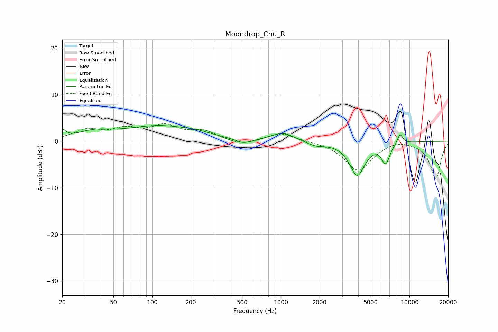

# Moondrop_Chu_R
See [usage instructions](https://github.com/jaakkopasanen/AutoEq#usage) for more options and info.

### Parametric EQs
Apply preamp of -3.5 dB when using parametric equalizer.

|   # | Type    |   Fc (Hz) |    Q |   Gain (dB) |
|-----|---------|-----------|------|-------------|
|   1 | Peaking |        20 | 5.35 |         1.6 |
|   2 | Peaking |        35 | 1.1  |         1.6 |
|   3 | Peaking |       114 | 0.52 |         3.1 |
|   4 | Peaking |       224 | 1.42 |         0.5 |
|   5 | Peaking |       514 | 2.28 |        -1.1 |
|   6 | Peaking |      1041 | 1.61 |         1.8 |
|   7 | Peaking |      1866 | 1.93 |        -0.9 |
|   8 | Peaking |      3924 | 2.36 |        -7.2 |
|   9 | Peaking |      6534 | 4.21 |        -4.1 |
|  10 | Peaking |      8442 | 6    |         2.2 |

### Fixed Band EQs
When using fixed band (also called graphic) equalizer, apply preamp of **-3.9 dB** (if available) and set gains manually with these parameters.

|   # | Type    |   Fc (Hz) |    Q |   Gain (dB) |
|-----|---------|-----------|------|-------------|
|   1 | Peaking |        31 | 1.41 |         2.2 |
|   2 | Peaking |        62 | 1.41 |         2.2 |
|   3 | Peaking |       125 | 1.41 |         2.9 |
|   4 | Peaking |       250 | 1.41 |         1.9 |
|   5 | Peaking |       500 | 1.41 |        -1   |
|   6 | Peaking |      1000 | 1.41 |         1.9 |
|   7 | Peaking |      2000 | 1.41 |        -0   |
|   8 | Peaking |      4000 | 1.41 |        -6.3 |
|   9 | Peaking |      8000 | 1.41 |         0.6 |
|  10 | Peaking |     16000 | 1.41 |        -8   |

### Graphs

