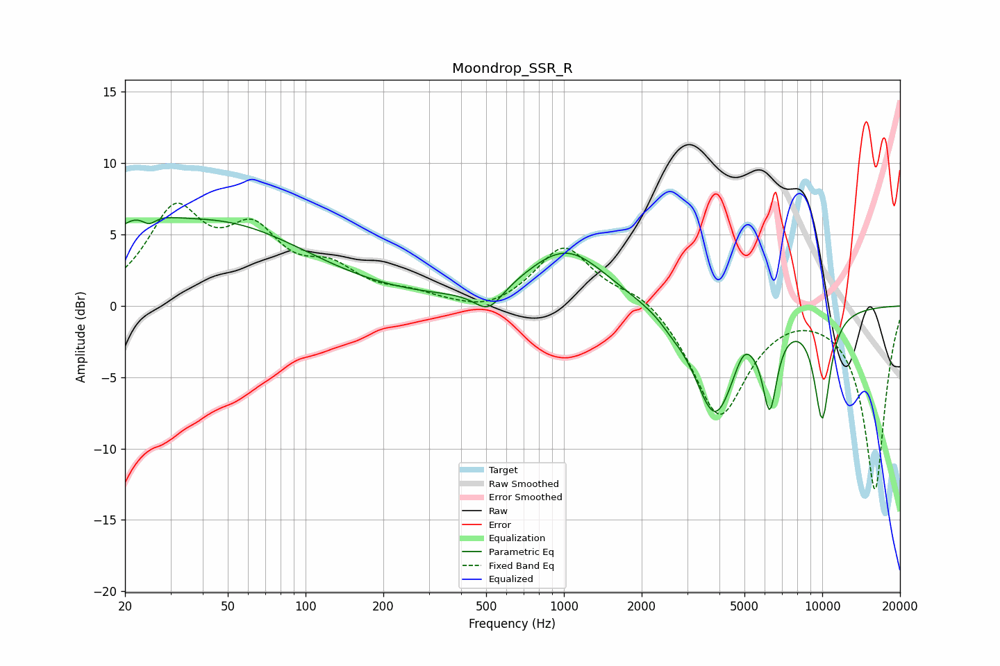

# Moondrop_SSR_R
See [usage instructions](https://github.com/jaakkopasanen/AutoEq#usage) for more options and info.

### Parametric EQs
Apply preamp of -6.3 dB when using parametric equalizer.

|   # | Type    |   Fc (Hz) |    Q |   Gain (dB) |
|-----|---------|-----------|------|-------------|
|   1 | Peaking |        22 | 1.16 |         2.8 |
|   2 | Peaking |        25 | 5.16 |        -0.7 |
|   3 | Peaking |        48 | 0.42 |         5.4 |
|   4 | Peaking |       510 | 2.56 |        -1.6 |
|   5 | Peaking |      1023 | 0.91 |         4   |
|   6 | Peaking |      2614 | 3.75 |        -0.3 |
|   7 | Peaking |      3846 | 1.69 |        -7.7 |
|   8 | Peaking |      4960 | 3.94 |         1.3 |
|   9 | Peaking |      6265 | 4.92 |        -5.5 |
|  10 | Peaking |     10000 | 3.85 |        -7.4 |

### Fixed Band EQs
When using fixed band (also called graphic) equalizer, apply preamp of **-7.3 dB** (if available) and set gains manually with these parameters.

|   # | Type    |   Fc (Hz) |    Q |   Gain (dB) |
|-----|---------|-----------|------|-------------|
|   1 | Peaking |        31 | 1.41 |         6.3 |
|   2 | Peaking |        62 | 1.41 |         4.4 |
|   3 | Peaking |       125 | 1.41 |         2.1 |
|   4 | Peaking |       250 | 1.41 |         0.7 |
|   5 | Peaking |       500 | 1.41 |        -0.7 |
|   6 | Peaking |      1000 | 1.41 |         4.2 |
|   7 | Peaking |      2000 | 1.41 |         1.1 |
|   8 | Peaking |      4000 | 1.41 |        -7.8 |
|   9 | Peaking |      8000 | 1.41 |         0.2 |
|  10 | Peaking |     16000 | 1.41 |       -12.9 |

### Graphs

