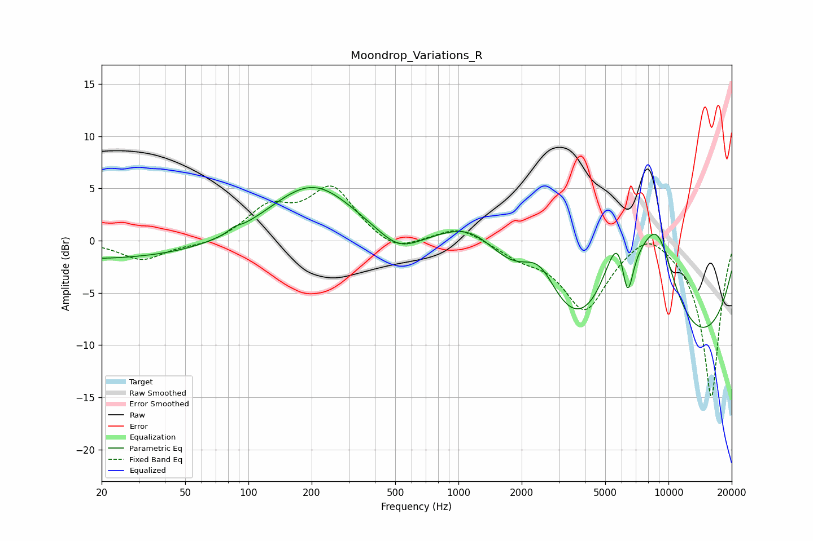

# Moondrop_Variations_R
See [usage instructions](https://github.com/jaakkopasanen/AutoEq#usage) for more options and info.

### Parametric EQs
Apply preamp of -5.2 dB when using parametric equalizer.

|   # | Type    |   Fc (Hz) |    Q |   Gain (dB) |
|-----|---------|-----------|------|-------------|
|   1 | Peaking |        20 | 0.21 |        -1.8 |
|   2 | Peaking |        86 | 5.78 |         0.3 |
|   3 | Peaking |       203 | 0.67 |         5.9 |
|   4 | Peaking |       517 | 1.45 |        -1.7 |
|   5 | Peaking |      1182 | 0.64 |         8.7 |
|   6 | Peaking |      2435 | 1.42 |         5.7 |
|   7 | Peaking |      5807 | 0.2  |       -20   |
|   8 | Peaking |      5911 | 1.27 |        15.1 |
|   9 | Peaking |      6374 | 4.37 |        -7   |
|  10 | Peaking |      8826 | 1.08 |        12.9 |

### Fixed Band EQs
When using fixed band (also called graphic) equalizer, apply preamp of **-5.3 dB** (if available) and set gains manually with these parameters.

|   # | Type    |   Fc (Hz) |    Q |   Gain (dB) |
|-----|---------|-----------|------|-------------|
|   1 | Peaking |        31 | 1.41 |        -1.8 |
|   2 | Peaking |        62 | 1.41 |        -0.5 |
|   3 | Peaking |       125 | 1.41 |         2.9 |
|   4 | Peaking |       250 | 1.41 |         4.9 |
|   5 | Peaking |       500 | 1.41 |        -1.4 |
|   6 | Peaking |      1000 | 1.41 |         1.4 |
|   7 | Peaking |      2000 | 1.41 |        -1.3 |
|   8 | Peaking |      4000 | 1.41 |        -6.5 |
|   9 | Peaking |      8000 | 1.41 |         1.8 |
|  10 | Peaking |     16000 | 1.41 |       -15.1 |

### Graphs

