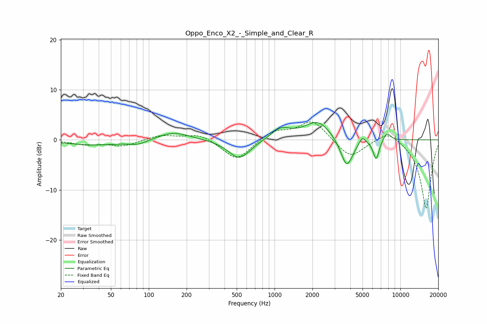

# Oppo_Enco_X2_-_Simple_and_Clear_R
See [usage instructions](https://github.com/jaakkopasanen/AutoEq#usage) for more options and info.

### Parametric EQs
Apply preamp of -3.6 dB when using parametric equalizer.

|   # | Type    |   Fc (Hz) |    Q |   Gain (dB) |
|-----|---------|-----------|------|-------------|
|   1 | Peaking |        37 | 0.63 |        -1   |
|   2 | Peaking |        82 | 1.89 |        -0.8 |
|   3 | Peaking |       158 | 1.1  |         1.7 |
|   4 | Peaking |       525 | 1.62 |        -3.9 |
|   5 | Peaking |      1117 | 1.84 |         2.2 |
|   6 | Peaking |      2202 | 1.35 |         3.8 |
|   7 | Peaking |      3743 | 2.85 |        -6   |
|   8 | Peaking |      4983 | 5.61 |         1.5 |
|   9 | Peaking |      6414 | 5.78 |        -4   |
|  10 | Peaking |      7810 | 4.38 |         1.6 |

### Fixed Band EQs
When using fixed band (also called graphic) equalizer, apply preamp of **-3.7 dB** (if available) and set gains manually with these parameters.

|   # | Type    |   Fc (Hz) |    Q |   Gain (dB) |
|-----|---------|-----------|------|-------------|
|   1 | Peaking |        31 | 1.41 |        -0.9 |
|   2 | Peaking |        62 | 1.41 |        -1.2 |
|   3 | Peaking |       125 | 1.41 |         1   |
|   4 | Peaking |       250 | 1.41 |         1.3 |
|   5 | Peaking |       500 | 1.41 |        -4.2 |
|   6 | Peaking |      1000 | 1.41 |         1.8 |
|   7 | Peaking |      2000 | 1.41 |         4   |
|   8 | Peaking |      4000 | 1.41 |        -3.7 |
|   9 | Peaking |      8000 | 1.41 |         2.2 |
|  10 | Peaking |     16000 | 1.41 |       -13.9 |

### Graphs

