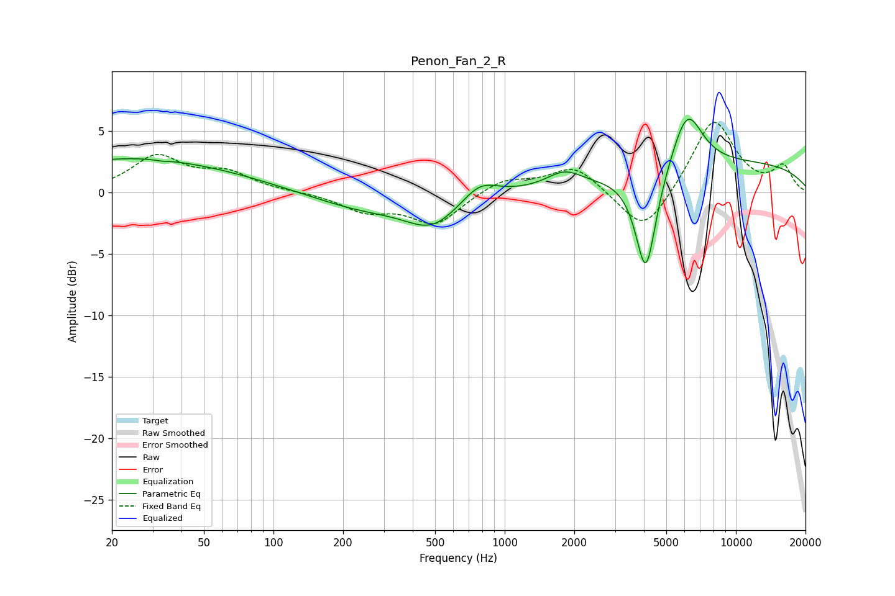

# Penon_Fan_2_R
See [usage instructions](https://github.com/jaakkopasanen/AutoEq#usage) for more options and info.

### Parametric EQs
Apply preamp of -6.0 dB when using parametric equalizer.

|   # | Type    |   Fc (Hz) |    Q |   Gain (dB) |
|-----|---------|-----------|------|-------------|
|   1 | Peaking |        20 | 0.42 |         2.3 |
|   2 | Peaking |        33 | 5.67 |        -0.1 |
|   3 | Peaking |        58 | 0.49 |         1   |
|   4 | Peaking |       247 | 0.62 |        -1.4 |
|   5 | Peaking |       487 | 1.24 |        -2.3 |
|   6 | Peaking |       781 | 1.87 |         1.4 |
|   7 | Peaking |      1811 | 1.88 |         1.2 |
|   8 | Peaking |      4081 | 3.08 |        -8.6 |
|   9 | Peaking |      6149 | 2.05 |         4.8 |
|  10 | Peaking |     10000 | 0.24 |         2.3 |

### Fixed Band EQs
When using fixed band (also called graphic) equalizer, apply preamp of **-5.8 dB** (if available) and set gains manually with these parameters.

|   # | Type    |   Fc (Hz) |    Q |   Gain (dB) |
|-----|---------|-----------|------|-------------|
|   1 | Peaking |        31 | 1.41 |         2.8 |
|   2 | Peaking |        62 | 1.41 |         1.5 |
|   3 | Peaking |       125 | 1.41 |         0   |
|   4 | Peaking |       250 | 1.41 |        -1.4 |
|   5 | Peaking |       500 | 1.41 |        -2.5 |
|   6 | Peaking |      1000 | 1.41 |         1.1 |
|   7 | Peaking |      2000 | 1.41 |         2.2 |
|   8 | Peaking |      4000 | 1.41 |        -3.6 |
|   9 | Peaking |      8000 | 1.41 |         6   |
|  10 | Peaking |     16000 | 1.41 |         2   |

### Graphs

