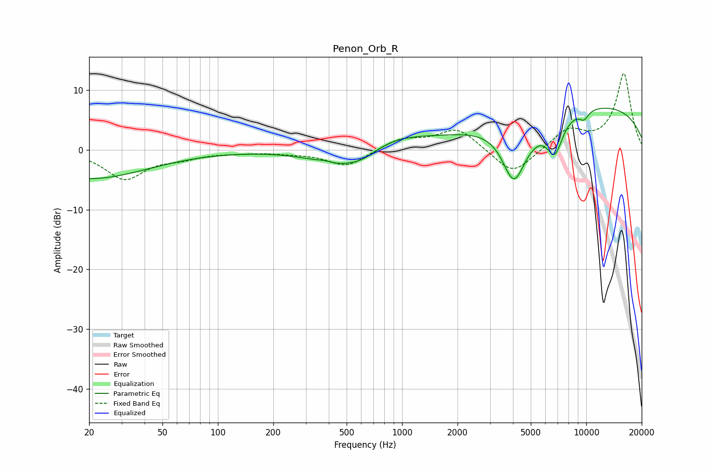

# Penon_Orb_R
See [usage instructions](https://github.com/jaakkopasanen/AutoEq#usage) for more options and info.

### Parametric EQs
Apply preamp of -7.1 dB when using parametric equalizer.

|   # | Type    |   Fc (Hz) |    Q |   Gain (dB) |
|-----|---------|-----------|------|-------------|
|   1 | Peaking |        20 | 0.45 |        -4.8 |
|   2 | Peaking |       378 | 3.58 |         0.3 |
|   3 | Peaking |       472 | 0.9  |        -3.1 |
|   4 | Peaking |       620 | 1.94 |        -0.9 |
|   5 | Peaking |       904 | 0.79 |         2   |
|   6 | Peaking |      3592 | 1.18 |         2.5 |
|   7 | Peaking |      4035 | 1.71 |       -12.9 |
|   8 | Peaking |      6748 | 3.08 |        -5.9 |
|   9 | Peaking |      9663 | 0.21 |         7.8 |
|  10 | Peaking |      9719 | 4.83 |        -1.4 |

### Fixed Band EQs
When using fixed band (also called graphic) equalizer, apply preamp of **-12.9 dB** (if available) and set gains manually with these parameters.

|   # | Type    |   Fc (Hz) |    Q |   Gain (dB) |
|-----|---------|-----------|------|-------------|
|   1 | Peaking |        31 | 1.41 |        -4.8 |
|   2 | Peaking |        62 | 1.41 |        -1.1 |
|   3 | Peaking |       125 | 1.41 |        -0.3 |
|   4 | Peaking |       250 | 1.41 |        -0.4 |
|   5 | Peaking |       500 | 1.41 |        -2.8 |
|   6 | Peaking |      1000 | 1.41 |         1.8 |
|   7 | Peaking |      2000 | 1.41 |         3.6 |
|   8 | Peaking |      4000 | 1.41 |        -4.4 |
|   9 | Peaking |      8000 | 1.41 |         3.3 |
|  10 | Peaking |     16000 | 1.41 |        12.7 |

### Graphs

