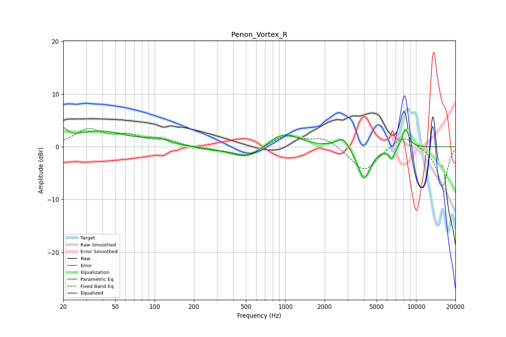

# Penon_Vortex_R
See [usage instructions](https://github.com/jaakkopasanen/AutoEq#usage) for more options and info.

### Parametric EQs
Apply preamp of -3.7 dB when using parametric equalizer.

|   # | Type    |   Fc (Hz) |    Q |   Gain (dB) |
|-----|---------|-----------|------|-------------|
|   1 | Peaking |        20 | 4.98 |         2   |
|   2 | Peaking |        38 | 0.67 |         2.9 |
|   3 | Peaking |       105 | 1.67 |         1   |
|   4 | Peaking |       350 | 0.8  |        -0.5 |
|   5 | Peaking |       516 | 1.37 |        -2   |
|   6 | Peaking |       972 | 1.27 |         2.8 |
|   7 | Peaking |      2767 | 2.83 |         2.2 |
|   8 | Peaking |      4002 | 2.76 |        -6.3 |
|   9 | Peaking |      6528 | 5.99 |        -2.1 |
|  10 | Peaking |      8298 | 4.9  |         3.6 |

### Fixed Band EQs
When using fixed band (also called graphic) equalizer, apply preamp of **-3.6 dB** (if available) and set gains manually with these parameters.

|   # | Type    |   Fc (Hz) |    Q |   Gain (dB) |
|-----|---------|-----------|------|-------------|
|   1 | Peaking |        31 | 1.41 |         3.1 |
|   2 | Peaking |        62 | 1.41 |         1.8 |
|   3 | Peaking |       125 | 1.41 |         1.1 |
|   4 | Peaking |       250 | 1.41 |        -0.6 |
|   5 | Peaking |       500 | 1.41 |        -1.9 |
|   6 | Peaking |      1000 | 1.41 |         2.2 |
|   7 | Peaking |      2000 | 1.41 |         1.8 |
|   8 | Peaking |      4000 | 1.41 |        -4.8 |
|   9 | Peaking |      8000 | 1.41 |         2.6 |
|  10 | Peaking |     16000 | 1.41 |        -7.5 |

### Graphs

