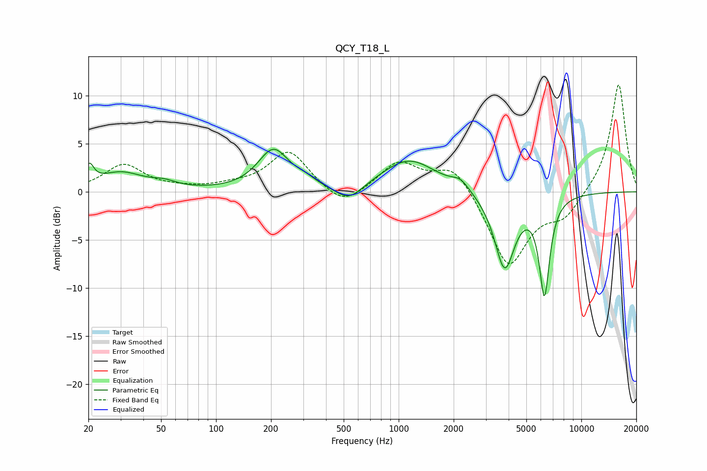

# QCY_T18_L
See [usage instructions](https://github.com/jaakkopasanen/AutoEq#usage) for more options and info.

### Parametric EQs
Apply preamp of -4.5 dB when using parametric equalizer.

|   # | Type    |   Fc (Hz) |    Q |   Gain (dB) |
|-----|---------|-----------|------|-------------|
|   1 | Peaking |        20 | 5.97 |         1.9 |
|   2 | Peaking |        30 | 1.13 |         1.9 |
|   3 | Peaking |        52 | 2.14 |         0.5 |
|   4 | Peaking |       206 | 1.68 |         4.2 |
|   5 | Peaking |       308 | 2.48 |         0.6 |
|   6 | Peaking |       534 | 1.87 |        -1.7 |
|   7 | Peaking |      1139 | 0.94 |         3.4 |
|   8 | Peaking |      2180 | 2.96 |         1   |
|   9 | Peaking |      3804 | 2.49 |        -7.9 |
|  10 | Peaking |      6282 | 4.8  |       -10.1 |

### Fixed Band EQs
When using fixed band (also called graphic) equalizer, apply preamp of **-11.2 dB** (if available) and set gains manually with these parameters.

|   # | Type    |   Fc (Hz) |    Q |   Gain (dB) |
|-----|---------|-----------|------|-------------|
|   1 | Peaking |        31 | 1.41 |         2.8 |
|   2 | Peaking |        62 | 1.41 |         0.2 |
|   3 | Peaking |       125 | 1.41 |         0.5 |
|   4 | Peaking |       250 | 1.41 |         4.2 |
|   5 | Peaking |       500 | 1.41 |        -1.9 |
|   6 | Peaking |      1000 | 1.41 |         3   |
|   7 | Peaking |      2000 | 1.41 |         2.9 |
|   8 | Peaking |      4000 | 1.41 |        -7.8 |
|   9 | Peaking |      8000 | 1.41 |        -2.4 |
|  10 | Peaking |     16000 | 1.41 |        11.4 |

### Graphs

