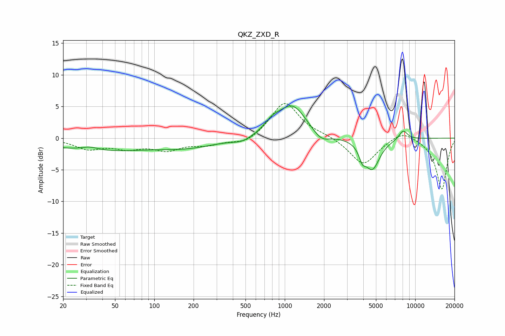

# QKZ_ZXD_R
See [usage instructions](https://github.com/jaakkopasanen/AutoEq#usage) for more options and info.

### Parametric EQs
Apply preamp of -5.2 dB when using parametric equalizer.

|   # | Type    |   Fc (Hz) |    Q |   Gain (dB) |
|-----|---------|-----------|------|-------------|
|   1 | Peaking |        32 | 1.97 |         0.6 |
|   2 | Peaking |        37 | 0.37 |        -2   |
|   3 | Peaking |       184 | 0.64 |        -1.2 |
|   4 | Peaking |       473 | 1.87 |        -0.8 |
|   5 | Peaking |       801 | 2.4  |         1.3 |
|   6 | Peaking |      1143 | 1.29 |         5.2 |
|   7 | Peaking |      1897 | 2.13 |        -1.5 |
|   8 | Peaking |      3931 | 5.64 |        -1.8 |
|   9 | Peaking |      4682 | 2.41 |        -4.8 |
|  10 | Peaking |      8088 | 4.01 |         1.5 |

### Fixed Band EQs
When using fixed band (also called graphic) equalizer, apply preamp of **-5.6 dB** (if available) and set gains manually with these parameters.

|   # | Type    |   Fc (Hz) |    Q |   Gain (dB) |
|-----|---------|-----------|------|-------------|
|   1 | Peaking |        31 | 1.41 |        -1.6 |
|   2 | Peaking |        62 | 1.41 |        -1.4 |
|   3 | Peaking |       125 | 1.41 |        -1.7 |
|   4 | Peaking |       250 | 1.41 |        -0.9 |
|   5 | Peaking |       500 | 1.41 |        -1.1 |
|   6 | Peaking |      1000 | 1.41 |         5.8 |
|   7 | Peaking |      2000 | 1.41 |         0.4 |
|   8 | Peaking |      4000 | 1.41 |        -4.3 |
|   9 | Peaking |      8000 | 1.41 |         1.4 |
|  10 | Peaking |     16000 | 1.41 |        -8.1 |

### Graphs

