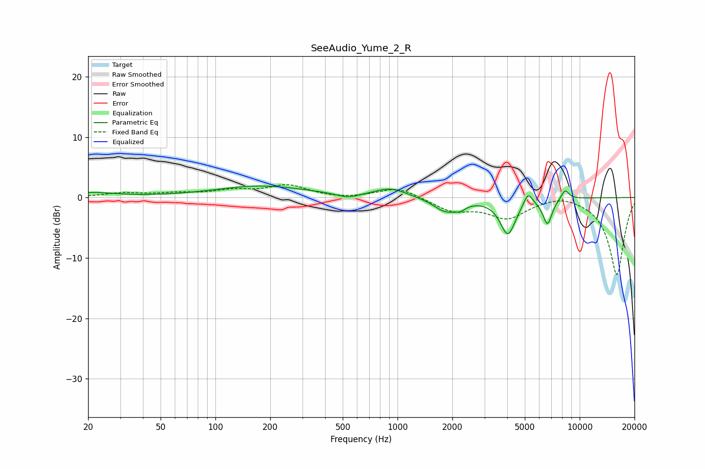

# SeeAudio_Yume_2_R
See [usage instructions](https://github.com/jaakkopasanen/AutoEq#usage) for more options and info.

### Parametric EQs
Apply preamp of -2.0 dB when using parametric equalizer.

|   # | Type    |   Fc (Hz) |    Q |   Gain (dB) |
|-----|---------|-----------|------|-------------|
|   1 | Peaking |        20 | 1.02 |         0.8 |
|   2 | Peaking |       179 | 0.55 |         1.9 |
|   3 | Peaking |       533 | 2.34 |        -0.8 |
|   4 | Peaking |       915 | 1.58 |         1.5 |
|   5 | Peaking |      1850 | 2.04 |        -2.3 |
|   6 | Peaking |      2216 | 4.92 |        -0.7 |
|   7 | Peaking |      4034 | 3.3  |        -5.9 |
|   8 | Peaking |      5203 | 6    |         2.1 |
|   9 | Peaking |      6656 | 5.44 |        -4.2 |
|  10 | Peaking |      8317 | 6    |         1.7 |

### Fixed Band EQs
When using fixed band (also called graphic) equalizer, apply preamp of **-2.2 dB** (if available) and set gains manually with these parameters.

|   # | Type    |   Fc (Hz) |    Q |   Gain (dB) |
|-----|---------|-----------|------|-------------|
|   1 | Peaking |        31 | 1.41 |         0.7 |
|   2 | Peaking |        62 | 1.41 |         0.6 |
|   3 | Peaking |       125 | 1.41 |         1   |
|   4 | Peaking |       250 | 1.41 |         1.9 |
|   5 | Peaking |       500 | 1.41 |        -0.2 |
|   6 | Peaking |      1000 | 1.41 |         1.7 |
|   7 | Peaking |      2000 | 1.41 |        -2.1 |
|   8 | Peaking |      4000 | 1.41 |        -3.2 |
|   9 | Peaking |      8000 | 1.41 |         0.8 |
|  10 | Peaking |     16000 | 1.41 |       -12.8 |

### Graphs

