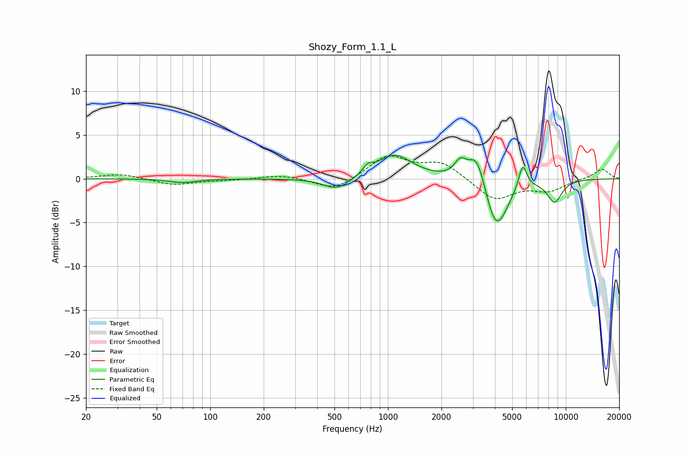

# Shozy_Form_1.1_L
See [usage instructions](https://github.com/jaakkopasanen/AutoEq#usage) for more options and info.

### Parametric EQs
Apply preamp of -2.8 dB when using parametric equalizer.

|   # | Type    |   Fc (Hz) |    Q |   Gain (dB) |
|-----|---------|-----------|------|-------------|
|   1 | Peaking |        70 | 1.87 |        -0.4 |
|   2 | Peaking |       517 | 1.84 |        -1.4 |
|   3 | Peaking |       770 | 5.21 |         0.8 |
|   4 | Peaking |      1085 | 1.41 |         2.8 |
|   5 | Peaking |      2553 | 4.24 |         1.7 |
|   6 | Peaking |      3167 | 2.9  |         3.7 |
|   7 | Peaking |      3949 | 2.76 |        -1.4 |
|   8 | Peaking |      4118 | 2.14 |        -4.7 |
|   9 | Peaking |      5731 | 6    |         2.8 |
|  10 | Peaking |      8659 | 3.15 |        -2.5 |

### Fixed Band EQs
When using fixed band (also called graphic) equalizer, apply preamp of **-2.7 dB** (if available) and set gains manually with these parameters.

|   # | Type    |   Fc (Hz) |    Q |   Gain (dB) |
|-----|---------|-----------|------|-------------|
|   1 | Peaking |        31 | 1.41 |         0.6 |
|   2 | Peaking |        62 | 1.41 |        -0.7 |
|   3 | Peaking |       125 | 1.41 |        -0.2 |
|   4 | Peaking |       250 | 1.41 |         0.5 |
|   5 | Peaking |       500 | 1.41 |        -1.4 |
|   6 | Peaking |      1000 | 1.41 |         2.6 |
|   7 | Peaking |      2000 | 1.41 |         1.8 |
|   8 | Peaking |      4000 | 1.41 |        -2.5 |
|   9 | Peaking |      8000 | 1.41 |        -1.3 |
|  10 | Peaking |     16000 | 1.41 |         1.1 |

### Graphs

