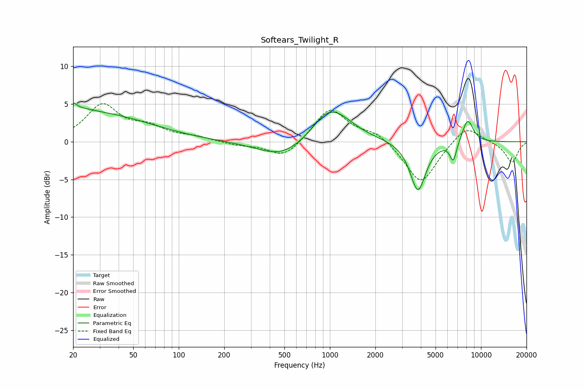

# Softears_Twilight_R
See [usage instructions](https://github.com/jaakkopasanen/AutoEq#usage) for more options and info.

### Parametric EQs
Apply preamp of -5.2 dB when using parametric equalizer.

|   # | Type    |   Fc (Hz) |    Q |   Gain (dB) |
|-----|---------|-----------|------|-------------|
|   1 | Peaking |        20 | 5.95 |        -2.2 |
|   2 | Peaking |        20 | 5.94 |         3.2 |
|   3 | Peaking |        21 | 1.36 |         1   |
|   4 | Peaking |        30 | 0.41 |         3.5 |
|   5 | Peaking |       484 | 0.89 |        -2.3 |
|   6 | Peaking |       910 | 2    |         0.7 |
|   7 | Peaking |      1054 | 1.1  |         4.1 |
|   8 | Peaking |      3824 | 2.72 |        -6.6 |
|   9 | Peaking |      6553 | 6    |        -2.6 |
|  10 | Peaking |      8164 | 3.55 |         3.1 |

### Fixed Band EQs
When using fixed band (also called graphic) equalizer, apply preamp of **-5.1 dB** (if available) and set gains manually with these parameters.

|   # | Type    |   Fc (Hz) |    Q |   Gain (dB) |
|-----|---------|-----------|------|-------------|
|   1 | Peaking |        31 | 1.41 |         4.7 |
|   2 | Peaking |        62 | 1.41 |         1.6 |
|   3 | Peaking |       125 | 1.41 |         0.5 |
|   4 | Peaking |       250 | 1.41 |        -0.4 |
|   5 | Peaking |       500 | 1.41 |        -2.2 |
|   6 | Peaking |      1000 | 1.41 |         4.5 |
|   7 | Peaking |      2000 | 1.41 |         1.3 |
|   8 | Peaking |      4000 | 1.41 |        -5.7 |
|   9 | Peaking |      8000 | 1.41 |         2.4 |
|  10 | Peaking |     16000 | 1.41 |        -2.8 |

### Graphs

