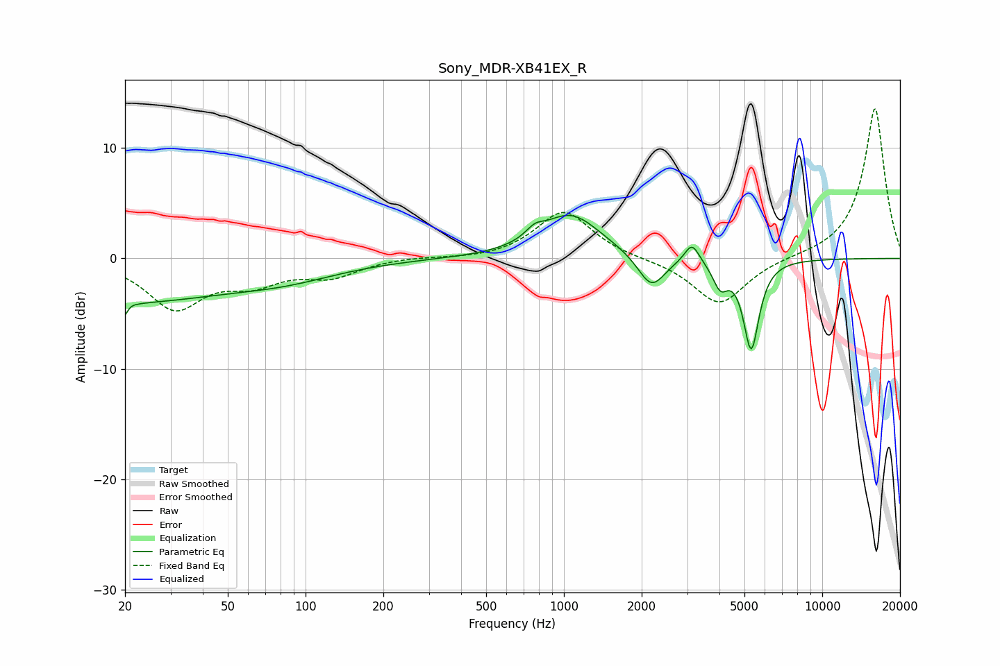

# Sony_MDR-XB41EX_R
See [usage instructions](https://github.com/jaakkopasanen/AutoEq#usage) for more options and info.

### Parametric EQs
Apply preamp of -4.0 dB when using parametric equalizer.

|   # | Type    |   Fc (Hz) |    Q |   Gain (dB) |
|-----|---------|-----------|------|-------------|
|   1 | Peaking |        20 | 5.93 |        -4.2 |
|   2 | Peaking |        20 | 0.35 |        -3.7 |
|   3 | Peaking |        20 | 6    |         3.1 |
|   4 | Peaking |        85 | 0.67 |        -1.3 |
|   5 | Peaking |       771 | 4.12 |         0.8 |
|   6 | Peaking |      1061 | 1.21 |         4   |
|   7 | Peaking |      2182 | 2.7  |        -3   |
|   8 | Peaking |      3131 | 4.91 |         1.8 |
|   9 | Peaking |      4032 | 4.87 |        -2.2 |
|  10 | Peaking |      5310 | 4.57 |        -8.1 |

### Fixed Band EQs
When using fixed band (also called graphic) equalizer, apply preamp of **-13.6 dB** (if available) and set gains manually with these parameters.

|   # | Type    |   Fc (Hz) |    Q |   Gain (dB) |
|-----|---------|-----------|------|-------------|
|   1 | Peaking |        31 | 1.41 |        -4.4 |
|   2 | Peaking |        62 | 1.41 |        -1.9 |
|   3 | Peaking |       125 | 1.41 |        -1.5 |
|   4 | Peaking |       250 | 1.41 |         0.2 |
|   5 | Peaking |       500 | 1.41 |        -0.1 |
|   6 | Peaking |      1000 | 1.41 |         4.3 |
|   7 | Peaking |      2000 | 1.41 |        -0.1 |
|   8 | Peaking |      4000 | 1.41 |        -4.3 |
|   9 | Peaking |      8000 | 1.41 |         0.1 |
|  10 | Peaking |     16000 | 1.41 |        13.7 |

### Graphs

