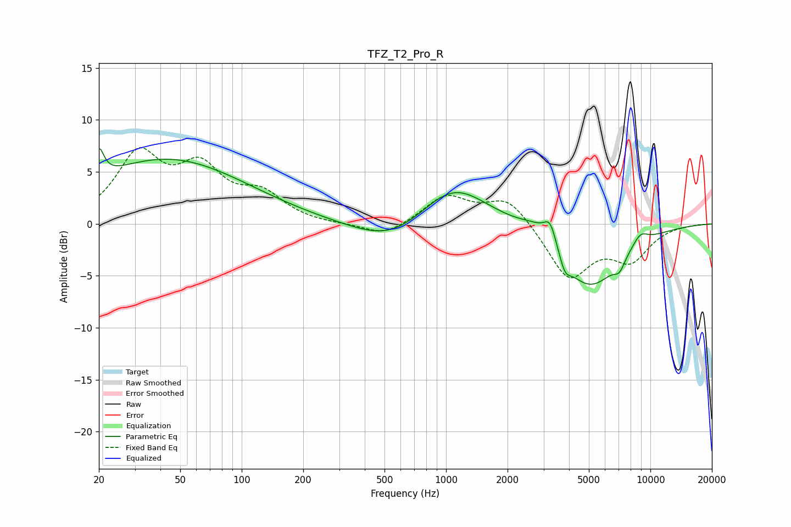

# TFZ_T2_Pro_R
See [usage instructions](https://github.com/jaakkopasanen/AutoEq#usage) for more options and info.

### Parametric EQs
Apply preamp of -7.3 dB when using parametric equalizer.

|   # | Type    |   Fc (Hz) |    Q |   Gain (dB) |
|-----|---------|-----------|------|-------------|
|   1 | Peaking |        20 | 5.9  |         2.8 |
|   2 | Peaking |        43 | 0.36 |         6.2 |
|   3 | Peaking |       542 | 0.77 |        -2.3 |
|   4 | Peaking |      1087 | 0.85 |         4.1 |
|   5 | Peaking |      2782 | 1.65 |         1.3 |
|   6 | Peaking |      3235 | 4.56 |         2.2 |
|   7 | Peaking |      3815 | 5.34 |        -1.4 |
|   8 | Peaking |      5002 | 0.91 |        -6.2 |
|   9 | Peaking |      7058 | 5.14 |        -1.1 |
|  10 | Peaking |      8916 | 3.24 |         1.2 |

### Fixed Band EQs
When using fixed band (also called graphic) equalizer, apply preamp of **-7.4 dB** (if available) and set gains manually with these parameters.

|   # | Type    |   Fc (Hz) |    Q |   Gain (dB) |
|-----|---------|-----------|------|-------------|
|   1 | Peaking |        31 | 1.41 |         6.3 |
|   2 | Peaking |        62 | 1.41 |         4.7 |
|   3 | Peaking |       125 | 1.41 |         2.5 |
|   4 | Peaking |       250 | 1.41 |        -0.1 |
|   5 | Peaking |       500 | 1.41 |        -1.3 |
|   6 | Peaking |      1000 | 1.41 |         2.6 |
|   7 | Peaking |      2000 | 1.41 |         2.6 |
|   8 | Peaking |      4000 | 1.41 |        -5.2 |
|   9 | Peaking |      8000 | 1.41 |        -3.2 |
|  10 | Peaking |     16000 | 1.41 |         0   |

### Graphs

