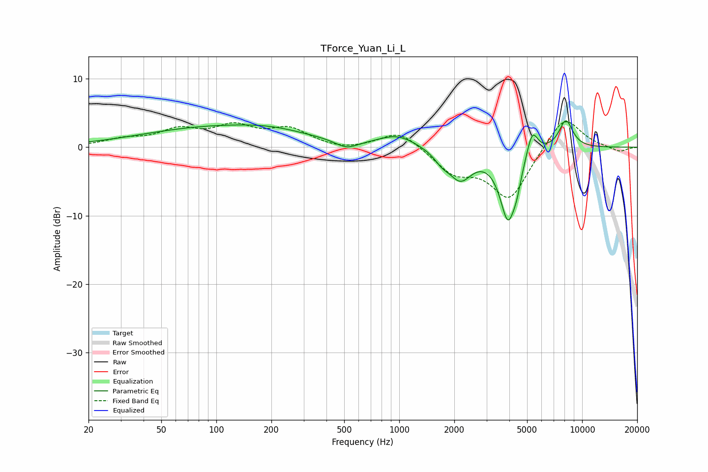

# TForce_Yuan_Li_L
See [usage instructions](https://github.com/jaakkopasanen/AutoEq#usage) for more options and info.

### Parametric EQs
Apply preamp of -3.9 dB when using parametric equalizer.

|   # | Type    |   Fc (Hz) |    Q |   Gain (dB) |
|-----|---------|-----------|------|-------------|
|   1 | Peaking |       105 | 0.33 |         2.9 |
|   2 | Peaking |       202 | 0.83 |         0.6 |
|   3 | Peaking |       515 | 2.29 |        -1.2 |
|   4 | Peaking |       979 | 1.41 |         1.7 |
|   5 | Peaking |      1706 | 3.41 |        -1.2 |
|   6 | Peaking |      2157 | 2.2  |        -4.3 |
|   7 | Peaking |      3933 | 3.05 |       -10.1 |
|   8 | Peaking |      4388 | 6    |        -1.9 |
|   9 | Peaking |      5337 | 4.55 |         3.9 |
|  10 | Peaking |      8149 | 3.41 |         4.1 |

### Fixed Band EQs
When using fixed band (also called graphic) equalizer, apply preamp of **-3.8 dB** (if available) and set gains manually with these parameters.

|   # | Type    |   Fc (Hz) |    Q |   Gain (dB) |
|-----|---------|-----------|------|-------------|
|   1 | Peaking |        31 | 1.41 |         1   |
|   2 | Peaking |        62 | 1.41 |         2.3 |
|   3 | Peaking |       125 | 1.41 |         2.7 |
|   4 | Peaking |       250 | 1.41 |         2.5 |
|   5 | Peaking |       500 | 1.41 |        -0.5 |
|   6 | Peaking |      1000 | 1.41 |         2.5 |
|   7 | Peaking |      2000 | 1.41 |        -3.4 |
|   8 | Peaking |      4000 | 1.41 |        -7.5 |
|   9 | Peaking |      8000 | 1.41 |         4.9 |
|  10 | Peaking |     16000 | 1.41 |        -0.7 |

### Graphs

