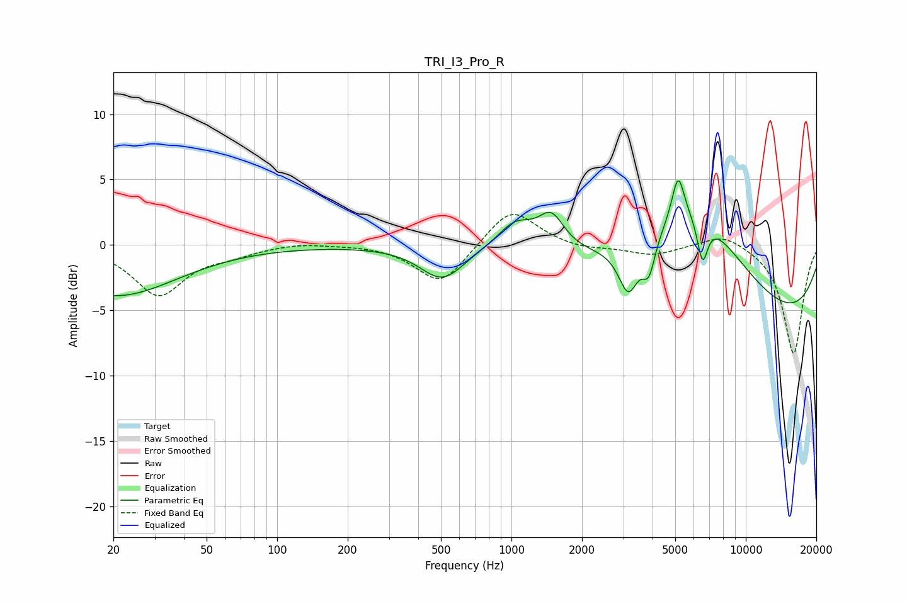

# TRI_I3_Pro_R
See [usage instructions](https://github.com/jaakkopasanen/AutoEq#usage) for more options and info.

### Parametric EQs
Apply preamp of -5.0 dB when using parametric equalizer.

|   # | Type    |   Fc (Hz) |    Q |   Gain (dB) |
|-----|---------|-----------|------|-------------|
|   1 | Peaking |        20 | 0.54 |        -3.9 |
|   2 | Peaking |       506 | 1.5  |        -2.6 |
|   3 | Peaking |      1041 | 1.82 |         2   |
|   4 | Peaking |      1480 | 2.59 |         2.5 |
|   5 | Peaking |      3157 | 3.33 |        -3.7 |
|   6 | Peaking |      3858 | 5.07 |        -2.6 |
|   7 | Peaking |      5145 | 5.3  |         3.5 |
|   8 | Peaking |      6018 | 0.59 |         8.5 |
|   9 | Peaking |      6535 | 5.99 |        -3.4 |
|  10 | Peaking |      9889 | 0.21 |        -6.8 |

### Fixed Band EQs
When using fixed band (also called graphic) equalizer, apply preamp of **-2.4 dB** (if available) and set gains manually with these parameters.

|   # | Type    |   Fc (Hz) |    Q |   Gain (dB) |
|-----|---------|-----------|------|-------------|
|   1 | Peaking |        31 | 1.41 |        -3.8 |
|   2 | Peaking |        62 | 1.41 |        -0.6 |
|   3 | Peaking |       125 | 1.41 |         0.2 |
|   4 | Peaking |       250 | 1.41 |         0.1 |
|   5 | Peaking |       500 | 1.41 |        -3.1 |
|   6 | Peaking |      1000 | 1.41 |         3   |
|   7 | Peaking |      2000 | 1.41 |        -0.3 |
|   8 | Peaking |      4000 | 1.41 |        -0.8 |
|   9 | Peaking |      8000 | 1.41 |         1   |
|  10 | Peaking |     16000 | 1.41 |        -8.4 |

### Graphs

