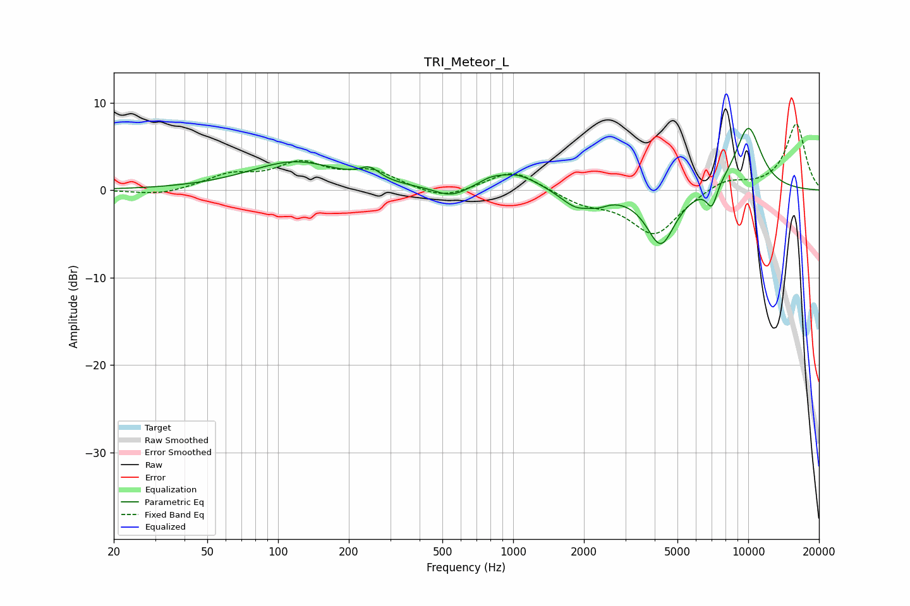

# TRI_Meteor_L
See [usage instructions](https://github.com/jaakkopasanen/AutoEq#usage) for more options and info.

### Parametric EQs
Apply preamp of -7.2 dB when using parametric equalizer.

|   # | Type    |   Fc (Hz) |    Q |   Gain (dB) |
|-----|---------|-----------|------|-------------|
|   1 | Peaking |       118 | 0.73 |         3.2 |
|   2 | Peaking |       246 | 3.37 |         1.3 |
|   3 | Peaking |       546 | 2.03 |        -1.2 |
|   4 | Peaking |       796 | 2.75 |         0.6 |
|   5 | Peaking |      1032 | 1.46 |         1.9 |
|   6 | Peaking |      1852 | 2.13 |        -1.9 |
|   7 | Peaking |      2308 | 3.28 |        -0.7 |
|   8 | Peaking |      4248 | 2.28 |        -6.3 |
|   9 | Peaking |      7009 | 5.82 |        -2.6 |
|  10 | Peaking |     10000 | 2.07 |         7.4 |

### Fixed Band EQs
When using fixed band (also called graphic) equalizer, apply preamp of **-7.7 dB** (if available) and set gains manually with these parameters.

|   # | Type    |   Fc (Hz) |    Q |   Gain (dB) |
|-----|---------|-----------|------|-------------|
|   1 | Peaking |        31 | 1.41 |        -0.6 |
|   2 | Peaking |        62 | 1.41 |         1.6 |
|   3 | Peaking |       125 | 1.41 |         2.8 |
|   4 | Peaking |       250 | 1.41 |         2   |
|   5 | Peaking |       500 | 1.41 |        -1.2 |
|   6 | Peaking |      1000 | 1.41 |         2.4 |
|   7 | Peaking |      2000 | 1.41 |        -1.4 |
|   8 | Peaking |      4000 | 1.41 |        -5.1 |
|   9 | Peaking |      8000 | 1.41 |         1.3 |
|  10 | Peaking |     16000 | 1.41 |         7.6 |

### Graphs

