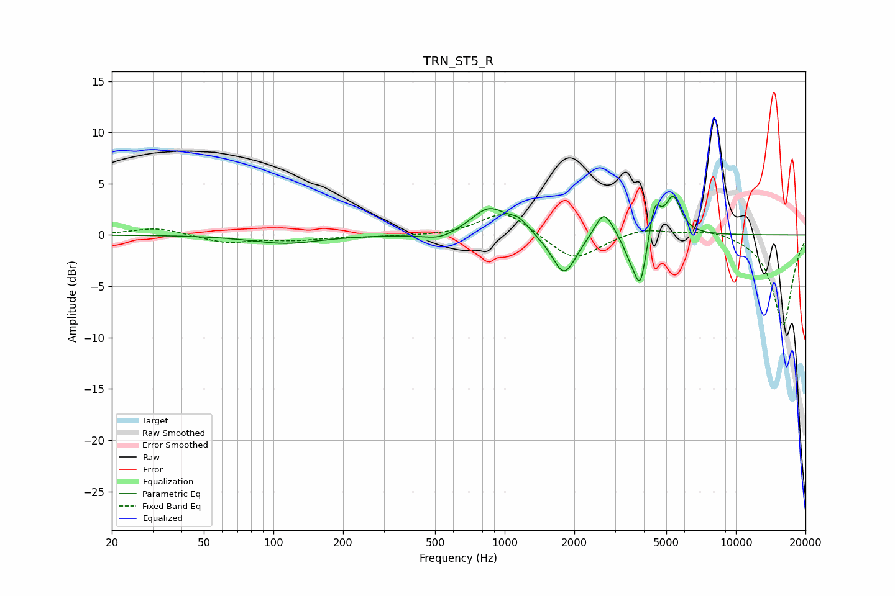

# TRN_ST5_R
See [usage instructions](https://github.com/jaakkopasanen/AutoEq#usage) for more options and info.

### Parametric EQs
Apply preamp of -3.9 dB when using parametric equalizer.

|   # | Type    |   Fc (Hz) |    Q |   Gain (dB) |
|-----|---------|-----------|------|-------------|
|   1 | Peaking |       113 | 0.97 |        -0.8 |
|   2 | Peaking |       525 | 2    |        -0.7 |
|   3 | Peaking |       858 | 1.79 |         2.7 |
|   4 | Peaking |      1154 | 3.5  |         1   |
|   5 | Peaking |      1807 | 2.73 |        -4.1 |
|   6 | Peaking |      2686 | 3.6  |         2.7 |
|   7 | Peaking |      3493 | 4.38 |        -1.5 |
|   8 | Peaking |      3863 | 5.34 |        -4.9 |
|   9 | Peaking |      4461 | 5.95 |         3.2 |
|  10 | Peaking |      5358 | 4.15 |         3.7 |

### Fixed Band EQs
When using fixed band (also called graphic) equalizer, apply preamp of **-2.1 dB** (if available) and set gains manually with these parameters.

|   # | Type    |   Fc (Hz) |    Q |   Gain (dB) |
|-----|---------|-----------|------|-------------|
|   1 | Peaking |        31 | 1.41 |         0.7 |
|   2 | Peaking |        62 | 1.41 |        -0.8 |
|   3 | Peaking |       125 | 1.41 |        -0.4 |
|   4 | Peaking |       250 | 1.41 |        -0.1 |
|   5 | Peaking |       500 | 1.41 |        -0.1 |
|   6 | Peaking |      1000 | 1.41 |         2.4 |
|   7 | Peaking |      2000 | 1.41 |        -2.6 |
|   8 | Peaking |      4000 | 1.41 |         0.8 |
|   9 | Peaking |      8000 | 1.41 |         0.6 |
|  10 | Peaking |     16000 | 1.41 |        -8.9 |

### Graphs

