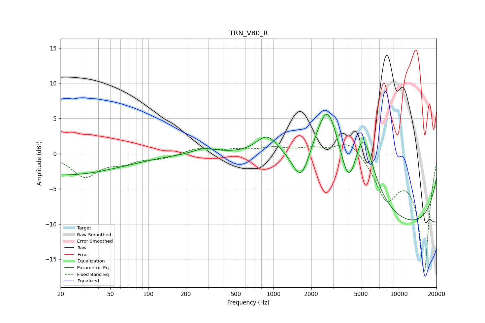

# TRN_V80_R
See [usage instructions](https://github.com/jaakkopasanen/AutoEq#usage) for more options and info.

### Parametric EQs
Apply preamp of -5.7 dB when using parametric equalizer.

|   # | Type    |   Fc (Hz) |    Q |   Gain (dB) |
|-----|---------|-----------|------|-------------|
|   1 | Peaking |        20 | 0.29 |        -3   |
|   2 | Peaking |        51 | 4.71 |         0   |
|   3 | Peaking |       282 | 1.56 |         0.8 |
|   4 | Peaking |       891 | 1.68 |         2.6 |
|   5 | Peaking |      1669 | 1.93 |        -5.5 |
|   6 | Peaking |      2702 | 1.96 |         4.7 |
|   7 | Peaking |      2742 | 0.67 |         9.2 |
|   8 | Peaking |      4009 | 1.99 |        -6.9 |
|   9 | Peaking |      5173 | 1.65 |         9.4 |
|  10 | Peaking |      9525 | 0.18 |       -10.7 |

### Fixed Band EQs
When using fixed band (also called graphic) equalizer, apply preamp of **-1.4 dB** (if available) and set gains manually with these parameters.

|   # | Type    |   Fc (Hz) |    Q |   Gain (dB) |
|-----|---------|-----------|------|-------------|
|   1 | Peaking |        31 | 1.41 |        -3.2 |
|   2 | Peaking |        62 | 1.41 |        -1.1 |
|   3 | Peaking |       125 | 1.41 |        -0.6 |
|   4 | Peaking |       250 | 1.41 |         0.8 |
|   5 | Peaking |       500 | 1.41 |         0.5 |
|   6 | Peaking |      1000 | 1.41 |         0.8 |
|   7 | Peaking |      2000 | 1.41 |         0.7 |
|   8 | Peaking |      4000 | 1.41 |         2.1 |
|   9 | Peaking |      8000 | 1.41 |        -5.8 |
|  10 | Peaking |     16000 | 1.41 |       -16.6 |

### Graphs

