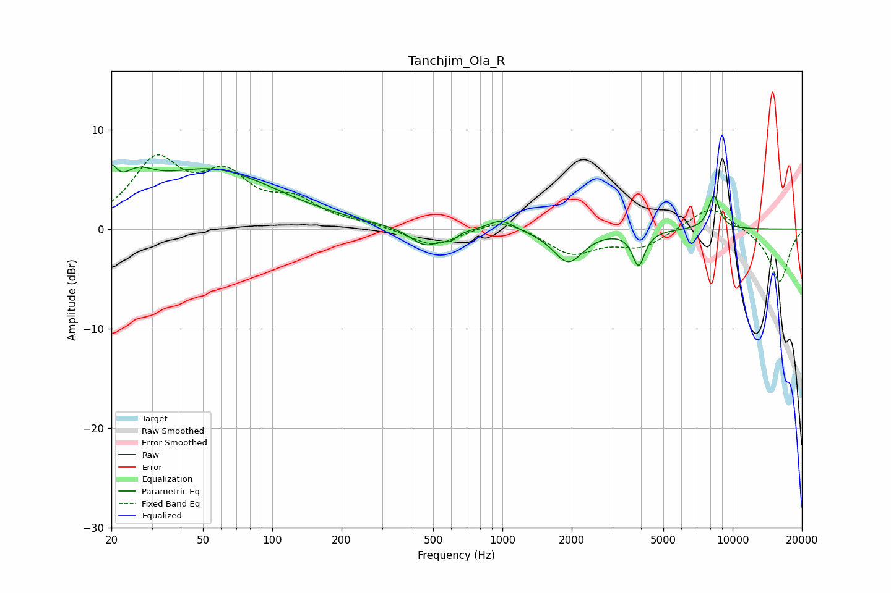

# Tanchjim_Ola_R
See [usage instructions](https://github.com/jaakkopasanen/AutoEq#usage) for more options and info.

### Parametric EQs
Apply preamp of -6.5 dB when using parametric equalizer.

|   # | Type    |   Fc (Hz) |    Q |   Gain (dB) |
|-----|---------|-----------|------|-------------|
|   1 | Peaking |        20 | 5.87 |         2.6 |
|   2 | Peaking |        26 | 1.97 |         2.3 |
|   3 | Peaking |        38 | 1.65 |        -0   |
|   4 | Peaking |        54 | 0.48 |         5.8 |
|   5 | Peaking |       463 | 2.16 |        -1.9 |
|   6 | Peaking |       595 | 5.63 |        -0.6 |
|   7 | Peaking |       988 | 2.52 |         1.1 |
|   8 | Peaking |      1931 | 2.18 |        -3.3 |
|   9 | Peaking |      3903 | 5.33 |        -3.5 |
|  10 | Peaking |      8296 | 5.42 |         3.4 |

### Fixed Band EQs
When using fixed band (also called graphic) equalizer, apply preamp of **-7.6 dB** (if available) and set gains manually with these parameters.

|   # | Type    |   Fc (Hz) |    Q |   Gain (dB) |
|-----|---------|-----------|------|-------------|
|   1 | Peaking |        31 | 1.41 |         6.5 |
|   2 | Peaking |        62 | 1.41 |         4.6 |
|   3 | Peaking |       125 | 1.41 |         2.4 |
|   4 | Peaking |       250 | 1.41 |         0.4 |
|   5 | Peaking |       500 | 1.41 |        -1.8 |
|   6 | Peaking |      1000 | 1.41 |         1.2 |
|   7 | Peaking |      2000 | 1.41 |        -2.5 |
|   8 | Peaking |      4000 | 1.41 |        -1.8 |
|   9 | Peaking |      8000 | 1.41 |         2.5 |
|  10 | Peaking |     16000 | 1.41 |        -5.4 |

### Graphs

