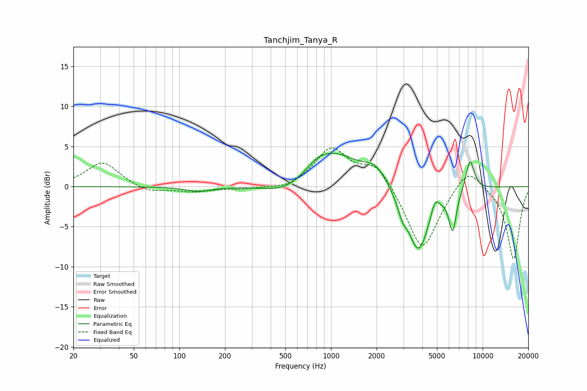

# Tanchjim_Tanya_R
See [usage instructions](https://github.com/jaakkopasanen/AutoEq#usage) for more options and info.

### Parametric EQs
Apply preamp of -4.3 dB when using parametric equalizer.

|   # | Type    |   Fc (Hz) |    Q |   Gain (dB) |
|-----|---------|-----------|------|-------------|
|   1 | Peaking |       134 | 1.62 |        -0.6 |
|   2 | Peaking |       515 | 0.98 |        -1.5 |
|   3 | Peaking |       804 | 2.06 |         0.8 |
|   4 | Peaking |      1037 | 0.84 |         4.2 |
|   5 | Peaking |      1965 | 1.9  |         2   |
|   6 | Peaking |      2944 | 4.97 |        -1.5 |
|   7 | Peaking |      3773 | 1.89 |        -8.3 |
|   8 | Peaking |      4851 | 5.03 |         2   |
|   9 | Peaking |      6344 | 5.64 |        -4.8 |
|  10 | Peaking |      8257 | 4.62 |         3.9 |

### Fixed Band EQs
When using fixed band (also called graphic) equalizer, apply preamp of **-4.9 dB** (if available) and set gains manually with these parameters.

|   # | Type    |   Fc (Hz) |    Q |   Gain (dB) |
|-----|---------|-----------|------|-------------|
|   1 | Peaking |        31 | 1.41 |         3.1 |
|   2 | Peaking |        62 | 1.41 |        -0.8 |
|   3 | Peaking |       125 | 1.41 |        -0.6 |
|   4 | Peaking |       250 | 1.41 |        -0.3 |
|   5 | Peaking |       500 | 1.41 |        -0.5 |
|   6 | Peaking |      1000 | 1.41 |         4.7 |
|   7 | Peaking |      2000 | 1.41 |         3   |
|   8 | Peaking |      4000 | 1.41 |        -8.3 |
|   9 | Peaking |      8000 | 1.41 |         3   |
|  10 | Peaking |     16000 | 1.41 |        -9.1 |

### Graphs

