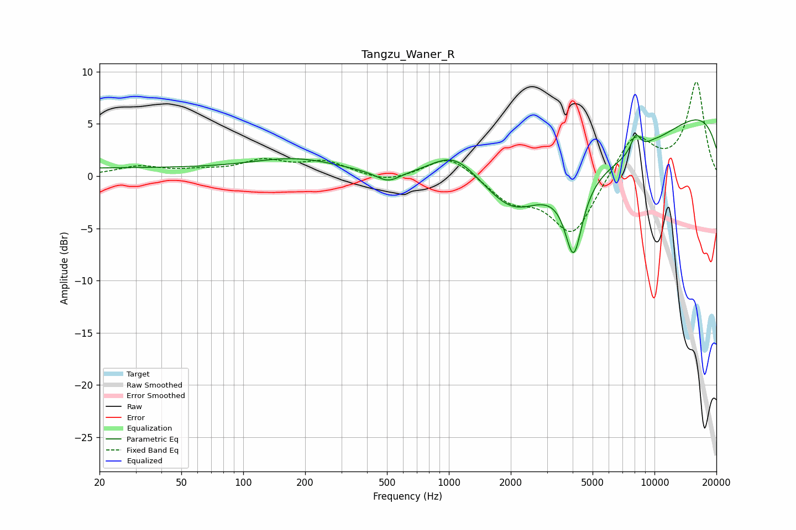

# Tangzu_Waner_R
See [usage instructions](https://github.com/jaakkopasanen/AutoEq#usage) for more options and info.

### Parametric EQs
Apply preamp of -5.5 dB when using parametric equalizer.

|   # | Type    |   Fc (Hz) |    Q |   Gain (dB) |
|-----|---------|-----------|------|-------------|
|   1 | Peaking |        20 | 0.18 |         0.7 |
|   2 | Peaking |       183 | 0.65 |         1.5 |
|   3 | Peaking |       506 | 2.45 |        -1   |
|   4 | Peaking |      1064 | 1.14 |         3.2 |
|   5 | Peaking |      2048 | 1.17 |        -2.3 |
|   6 | Peaking |      4045 | 3.32 |        -7.1 |
|   7 | Peaking |      5060 | 0.26 |        -7.8 |
|   8 | Peaking |      8104 | 5.55 |         1.7 |
|   9 | Peaking |      9679 | 0.19 |         9.7 |
|  10 | Peaking |      9947 | 5.93 |         0.1 |

### Fixed Band EQs
When using fixed band (also called graphic) equalizer, apply preamp of **-9.1 dB** (if available) and set gains manually with these parameters.

|   # | Type    |   Fc (Hz) |    Q |   Gain (dB) |
|-----|---------|-----------|------|-------------|
|   1 | Peaking |        31 | 1.41 |         0.9 |
|   2 | Peaking |        62 | 1.41 |         0.4 |
|   3 | Peaking |       125 | 1.41 |         1.4 |
|   4 | Peaking |       250 | 1.41 |         1.3 |
|   5 | Peaking |       500 | 1.41 |        -0.7 |
|   6 | Peaking |      1000 | 1.41 |         2.1 |
|   7 | Peaking |      2000 | 1.41 |        -2.2 |
|   8 | Peaking |      4000 | 1.41 |        -5.7 |
|   9 | Peaking |      8000 | 1.41 |         4.1 |
|  10 | Peaking |     16000 | 1.41 |         8.9 |

### Graphs

