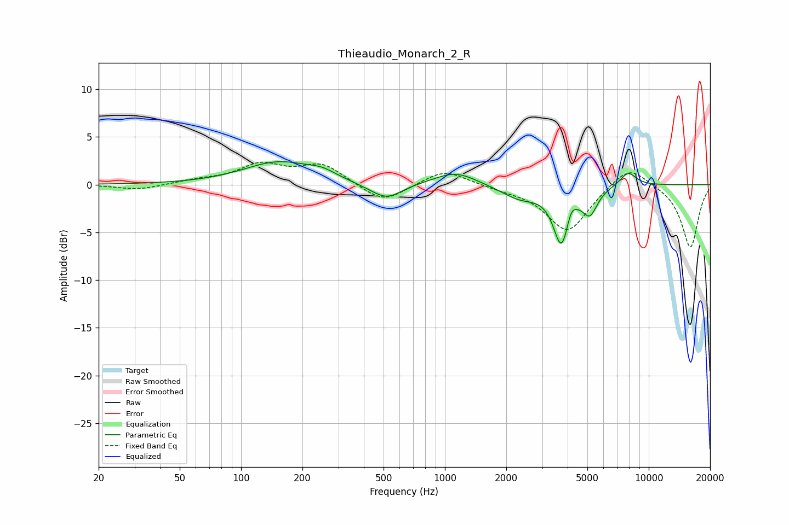

# Thieaudio_Monarch_2_R
See [usage instructions](https://github.com/jaakkopasanen/AutoEq#usage) for more options and info.

### Parametric EQs
Apply preamp of -2.5 dB when using parametric equalizer.

|   # | Type    |   Fc (Hz) |    Q |   Gain (dB) |
|-----|---------|-----------|------|-------------|
|   1 | Peaking |       154 | 0.82 |         2.3 |
|   2 | Peaking |       250 | 2.16 |         0.6 |
|   3 | Peaking |       419 | 1.54 |        -0.2 |
|   4 | Peaking |       519 | 1.9  |        -1.6 |
|   5 | Peaking |      1130 | 1.39 |         1.4 |
|   6 | Peaking |      2343 | 1.48 |        -1.4 |
|   7 | Peaking |      3732 | 3.58 |        -5.9 |
|   8 | Peaking |      4151 | 6    |         1.3 |
|   9 | Peaking |      5146 | 3.77 |        -2.6 |
|  10 | Peaking |      7918 | 3.23 |         1.5 |

### Fixed Band EQs
When using fixed band (also called graphic) equalizer, apply preamp of **-2.4 dB** (if available) and set gains manually with these parameters.

|   # | Type    |   Fc (Hz) |    Q |   Gain (dB) |
|-----|---------|-----------|------|-------------|
|   1 | Peaking |        31 | 1.41 |        -0.6 |
|   2 | Peaking |        62 | 1.41 |         0.4 |
|   3 | Peaking |       125 | 1.41 |         2   |
|   4 | Peaking |       250 | 1.41 |         2.1 |
|   5 | Peaking |       500 | 1.41 |        -2   |
|   6 | Peaking |      1000 | 1.41 |         1.7 |
|   7 | Peaking |      2000 | 1.41 |        -0.3 |
|   8 | Peaking |      4000 | 1.41 |        -4.9 |
|   9 | Peaking |      8000 | 1.41 |         2.3 |
|  10 | Peaking |     16000 | 1.41 |        -6.6 |

### Graphs

