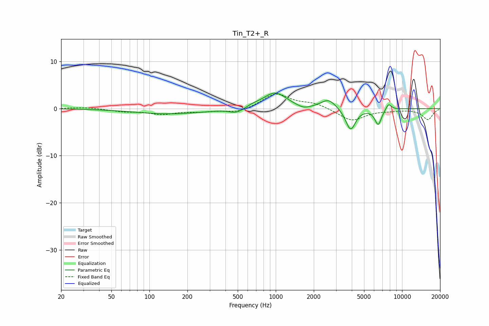

# Tin_T2+_R
See [usage instructions](https://github.com/jaakkopasanen/AutoEq#usage) for more options and info.

### Parametric EQs
Apply preamp of -3.4 dB when using parametric equalizer.

|   # | Type    |   Fc (Hz) |    Q |   Gain (dB) |
|-----|---------|-----------|------|-------------|
|   1 | Peaking |       144 | 0.5  |        -1.1 |
|   2 | Peaking |       482 | 2.7  |        -0.8 |
|   3 | Peaking |       555 | 2.22 |        -0.4 |
|   4 | Peaking |       644 | 2.19 |         0.6 |
|   5 | Peaking |       987 | 1.56 |         3.4 |
|   6 | Peaking |      1666 | 2.73 |        -0.7 |
|   7 | Peaking |      2618 | 2.4  |         2   |
|   8 | Peaking |      3913 | 3.58 |        -4.7 |
|   9 | Peaking |      6471 | 5.19 |        -3.4 |
|  10 | Peaking |      7814 | 6    |         1.4 |

### Fixed Band EQs
When using fixed band (also called graphic) equalizer, apply preamp of **-3.2 dB** (if available) and set gains manually with these parameters.

|   # | Type    |   Fc (Hz) |    Q |   Gain (dB) |
|-----|---------|-----------|------|-------------|
|   1 | Peaking |        31 | 1.41 |         0.3 |
|   2 | Peaking |        62 | 1.41 |        -0.6 |
|   3 | Peaking |       125 | 1.41 |        -1.1 |
|   4 | Peaking |       250 | 1.41 |        -0.5 |
|   5 | Peaking |       500 | 1.41 |        -0.9 |
|   6 | Peaking |      1000 | 1.41 |         3.2 |
|   7 | Peaking |      2000 | 1.41 |         1   |
|   8 | Peaking |      4000 | 1.41 |        -2.6 |
|   9 | Peaking |      8000 | 1.41 |        -0.3 |
|  10 | Peaking |     16000 | 1.41 |        -2.3 |

### Graphs

