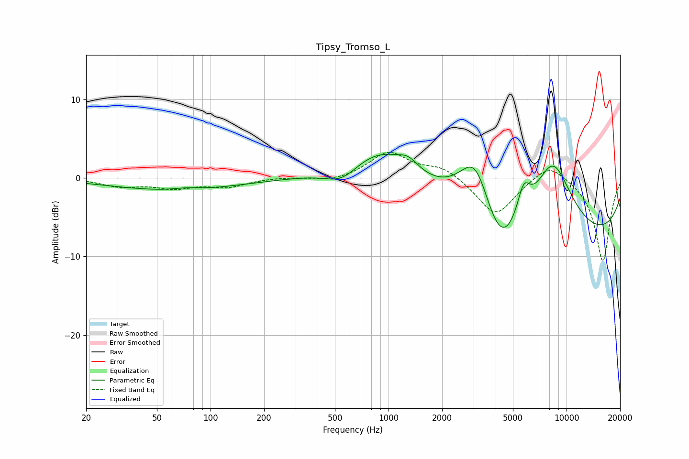

# Tipsy_Tromso_L
See [usage instructions](https://github.com/jaakkopasanen/AutoEq#usage) for more options and info.

### Parametric EQs
Apply preamp of -3.1 dB when using parametric equalizer.

|   # | Type    |   Fc (Hz) |    Q |   Gain (dB) |
|-----|---------|-----------|------|-------------|
|   1 | Peaking |        62 | 0.4  |        -1.6 |
|   2 | Peaking |        73 | 2.1  |         0.3 |
|   3 | Peaking |       548 | 1.47 |        -2   |
|   4 | Peaking |       905 | 0.76 |         4.4 |
|   5 | Peaking |      1293 | 2.59 |         1.2 |
|   6 | Peaking |      3087 | 1.41 |         9.1 |
|   7 | Peaking |      4222 | 1.24 |        -7.1 |
|   8 | Peaking |      5738 | 3.68 |         4   |
|   9 | Peaking |      8359 | 1.1  |        10.1 |
|  10 | Peaking |      9524 | 0.18 |        -8.3 |

### Fixed Band EQs
When using fixed band (also called graphic) equalizer, apply preamp of **-3.4 dB** (if available) and set gains manually with these parameters.

|   # | Type    |   Fc (Hz) |    Q |   Gain (dB) |
|-----|---------|-----------|------|-------------|
|   1 | Peaking |        31 | 1.41 |        -1   |
|   2 | Peaking |        62 | 1.41 |        -1.1 |
|   3 | Peaking |       125 | 1.41 |        -1   |
|   4 | Peaking |       250 | 1.41 |         0.1 |
|   5 | Peaking |       500 | 1.41 |        -0.5 |
|   6 | Peaking |      1000 | 1.41 |         3.3 |
|   7 | Peaking |      2000 | 1.41 |         1.4 |
|   8 | Peaking |      4000 | 1.41 |        -4.9 |
|   9 | Peaking |      8000 | 1.41 |         2.2 |
|  10 | Peaking |     16000 | 1.41 |       -10.7 |

### Graphs

