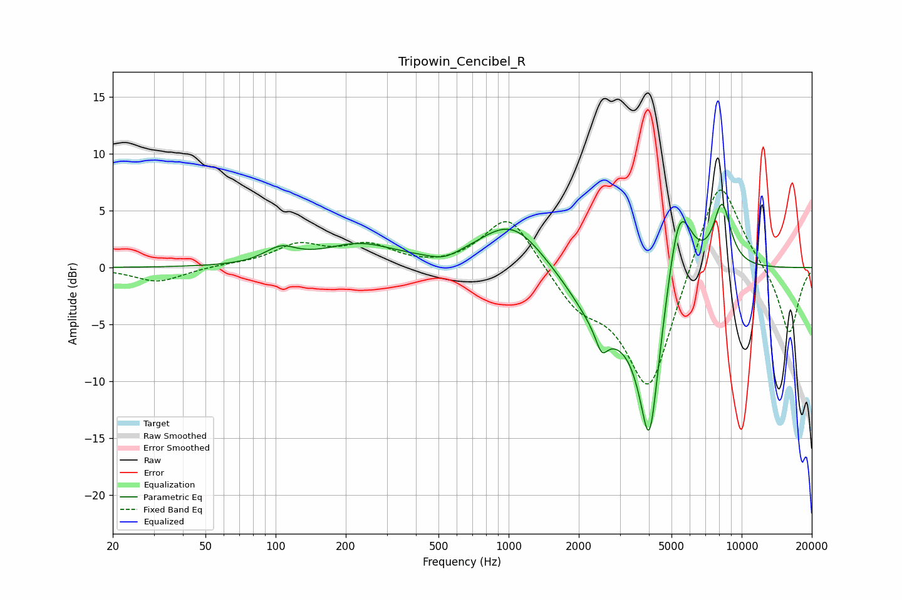

# Tripowin_Cencibel_R
See [usage instructions](https://github.com/jaakkopasanen/AutoEq#usage) for more options and info.

### Parametric EQs
Apply preamp of -5.7 dB when using parametric equalizer.

|   # | Type    |   Fc (Hz) |    Q |   Gain (dB) |
|-----|---------|-----------|------|-------------|
|   1 | Peaking |       105 | 2.07 |         1.3 |
|   2 | Peaking |       228 | 0.91 |         1.9 |
|   3 | Peaking |       529 | 2.12 |        -0.7 |
|   4 | Peaking |      1035 | 1    |         4.3 |
|   5 | Peaking |      2508 | 5.71 |        -1.8 |
|   6 | Peaking |      2527 | 1.07 |        -4.8 |
|   7 | Peaking |      4020 | 2.81 |       -14.6 |
|   8 | Peaking |      5319 | 3.04 |         2.8 |
|   9 | Peaking |      5440 | 2.35 |         5.4 |
|  10 | Peaking |      8240 | 3.45 |         5.6 |

### Fixed Band EQs
When using fixed band (also called graphic) equalizer, apply preamp of **-6.9 dB** (if available) and set gains manually with these parameters.

|   # | Type    |   Fc (Hz) |    Q |   Gain (dB) |
|-----|---------|-----------|------|-------------|
|   1 | Peaking |        31 | 1.41 |        -1.3 |
|   2 | Peaking |        62 | 1.41 |         0.2 |
|   3 | Peaking |       125 | 1.41 |         1.8 |
|   4 | Peaking |       250 | 1.41 |         1.8 |
|   5 | Peaking |       500 | 1.41 |        -0.1 |
|   6 | Peaking |      1000 | 1.41 |         4.9 |
|   7 | Peaking |      2000 | 1.41 |        -2.9 |
|   8 | Peaking |      4000 | 1.41 |       -11.2 |
|   9 | Peaking |      8000 | 1.41 |         9   |
|  10 | Peaking |     16000 | 1.41 |        -6   |

### Graphs

