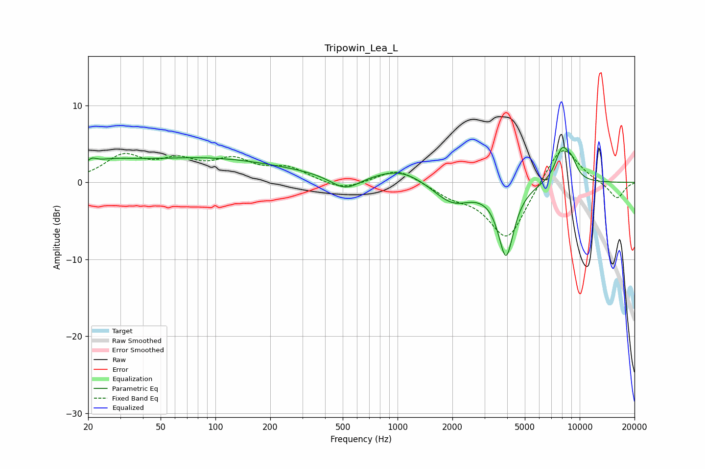

# Tripowin_Lea_L
See [usage instructions](https://github.com/jaakkopasanen/AutoEq#usage) for more options and info.

### Parametric EQs
Apply preamp of -4.6 dB when using parametric equalizer.

|   # | Type    |   Fc (Hz) |    Q |   Gain (dB) |
|-----|---------|-----------|------|-------------|
|   1 | Peaking |        21 | 5.81 |         0.7 |
|   2 | Peaking |        25 | 0.96 |         1.3 |
|   3 | Peaking |        62 | 0.34 |         2   |
|   4 | Peaking |       161 | 0.32 |         1.4 |
|   5 | Peaking |       515 | 1.72 |        -1.9 |
|   6 | Peaking |      1042 | 1.02 |         1.8 |
|   7 | Peaking |      2000 | 1.33 |        -2.8 |
|   8 | Peaking |      3942 | 3.22 |        -9.2 |
|   9 | Peaking |      8001 | 3.39 |         4.2 |
|  10 | Peaking |      9050 | 4.16 |         1.8 |

### Fixed Band EQs
When using fixed band (also called graphic) equalizer, apply preamp of **-4.2 dB** (if available) and set gains manually with these parameters.

|   # | Type    |   Fc (Hz) |    Q |   Gain (dB) |
|-----|---------|-----------|------|-------------|
|   1 | Peaking |        31 | 1.41 |         3.2 |
|   2 | Peaking |        62 | 1.41 |         2.3 |
|   3 | Peaking |       125 | 1.41 |         2.5 |
|   4 | Peaking |       250 | 1.41 |         1.7 |
|   5 | Peaking |       500 | 1.41 |        -1.1 |
|   6 | Peaking |      1000 | 1.41 |         1.9 |
|   7 | Peaking |      2000 | 1.41 |        -1.4 |
|   8 | Peaking |      4000 | 1.41 |        -7.5 |
|   9 | Peaking |      8000 | 1.41 |         5.4 |
|  10 | Peaking |     16000 | 1.41 |        -2.2 |

### Graphs

