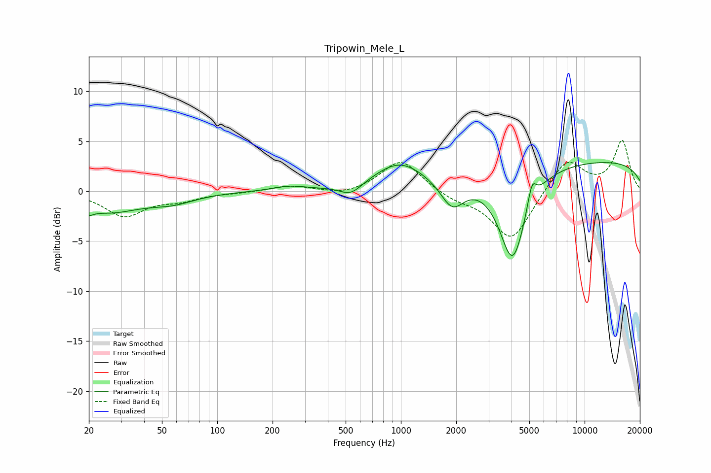

# Tripowin_Mele_L
See [usage instructions](https://github.com/jaakkopasanen/AutoEq#usage) for more options and info.

### Parametric EQs
Apply preamp of -3.0 dB when using parametric equalizer.

|   # | Type    |   Fc (Hz) |    Q |   Gain (dB) |
|-----|---------|-----------|------|-------------|
|   1 | Peaking |        20 | 5.79 |        -0.6 |
|   2 | Peaking |        25 | 0.79 |        -2   |
|   3 | Peaking |        57 | 1.16 |        -0.8 |
|   4 | Peaking |       246 | 1.58 |         0.4 |
|   5 | Peaking |       534 | 2.33 |        -1.1 |
|   6 | Peaking |       980 | 1.03 |         2.6 |
|   7 | Peaking |      1904 | 2.19 |        -2.8 |
|   8 | Peaking |      4055 | 1.9  |        -9.1 |
|   9 | Peaking |      5167 | 5.96 |         2.3 |
|  10 | Peaking |     10000 | 0.18 |         3.1 |

### Fixed Band EQs
When using fixed band (also called graphic) equalizer, apply preamp of **-5.2 dB** (if available) and set gains manually with these parameters.

|   # | Type    |   Fc (Hz) |    Q |   Gain (dB) |
|-----|---------|-----------|------|-------------|
|   1 | Peaking |        31 | 1.41 |        -2.4 |
|   2 | Peaking |        62 | 1.41 |        -0.8 |
|   3 | Peaking |       125 | 1.41 |        -0.1 |
|   4 | Peaking |       250 | 1.41 |         0.6 |
|   5 | Peaking |       500 | 1.41 |        -0.5 |
|   6 | Peaking |      1000 | 1.41 |         3.2 |
|   7 | Peaking |      2000 | 1.41 |        -0.8 |
|   8 | Peaking |      4000 | 1.41 |        -5   |
|   9 | Peaking |      8000 | 1.41 |         3.3 |
|  10 | Peaking |     16000 | 1.41 |         5   |

### Graphs

