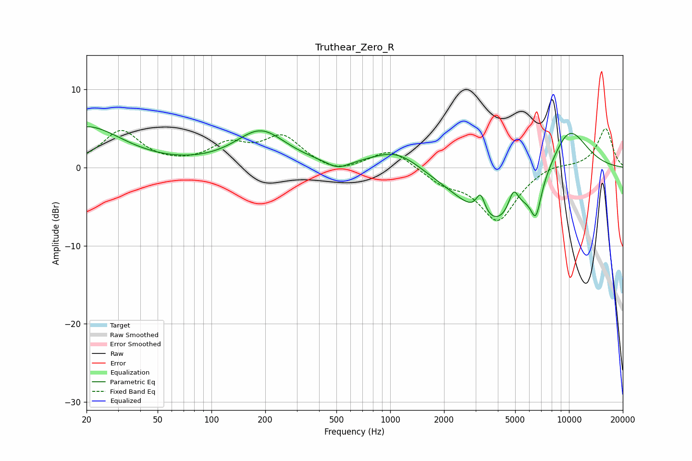

# Truthear_Zero_R
See [usage instructions](https://github.com/jaakkopasanen/AutoEq#usage) for more options and info.

### Parametric EQs
Apply preamp of -5.3 dB when using parametric equalizer.

|   # | Type    |   Fc (Hz) |    Q |   Gain (dB) |
|-----|---------|-----------|------|-------------|
|   1 | Peaking |        20 | 0.71 |         5.2 |
|   2 | Peaking |       189 | 1    |         4.6 |
|   3 | Peaking |       509 | 2.29 |        -1   |
|   4 | Peaking |      1084 | 1.02 |         2.6 |
|   5 | Peaking |      3201 | 5.75 |         2.7 |
|   6 | Peaking |      3973 | 0.72 |        -7.9 |
|   7 | Peaking |      4896 | 4.81 |         3   |
|   8 | Peaking |      6530 | 4.52 |        -4.3 |
|   9 | Peaking |      9517 | 2.31 |         0.3 |
|  10 | Peaking |     10000 | 1.08 |         5.9 |

### Fixed Band EQs
When using fixed band (also called graphic) equalizer, apply preamp of **-5.1 dB** (if available) and set gains manually with these parameters.

|   # | Type    |   Fc (Hz) |    Q |   Gain (dB) |
|-----|---------|-----------|------|-------------|
|   1 | Peaking |        31 | 1.41 |         4.6 |
|   2 | Peaking |        62 | 1.41 |         0   |
|   3 | Peaking |       125 | 1.41 |         2.6 |
|   4 | Peaking |       250 | 1.41 |         3.7 |
|   5 | Peaking |       500 | 1.41 |        -0.9 |
|   6 | Peaking |      1000 | 1.41 |         2.4 |
|   7 | Peaking |      2000 | 1.41 |        -1.7 |
|   8 | Peaking |      4000 | 1.41 |        -6.7 |
|   9 | Peaking |      8000 | 1.41 |         0.6 |
|  10 | Peaking |     16000 | 1.41 |         5   |

### Graphs

