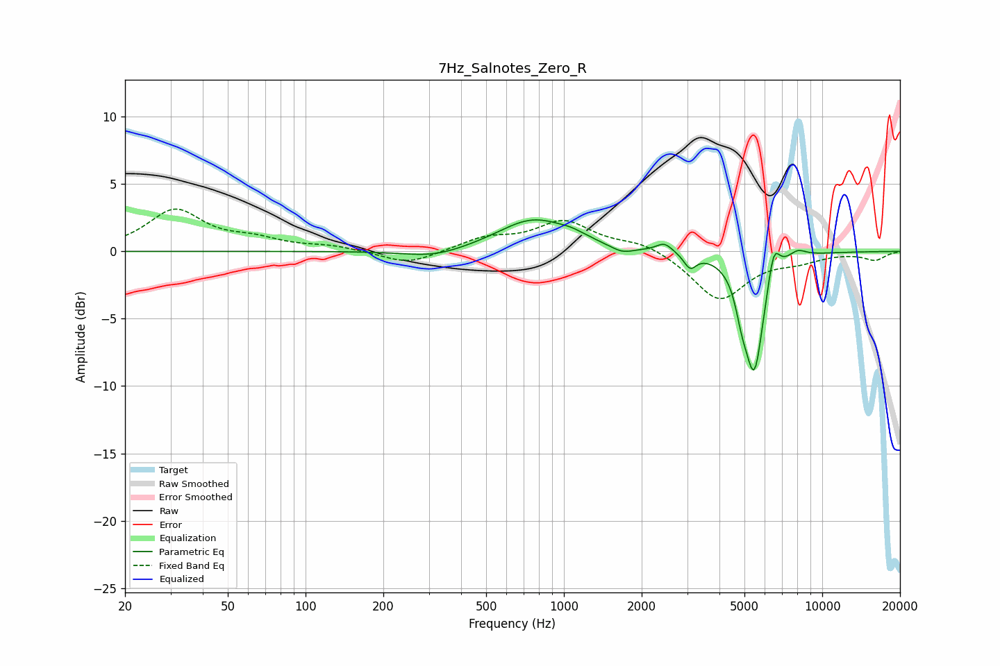

# 7Hz_Salnotes_Zero_R
See [usage instructions](https://github.com/jaakkopasanen/AutoEq#usage) for more options and info.

### Parametric EQs
Apply preamp of -2.4 dB when using parametric equalizer.

|   # | Type    |   Fc (Hz) |    Q |   Gain (dB) |
|-----|---------|-----------|------|-------------|
|   1 | Peaking |       315 | 1.19 |        -0.6 |
|   2 | Peaking |       762 | 1.03 |         2.4 |
|   3 | Peaking |      1080 | 2.73 |         0.3 |
|   4 | Peaking |      1681 | 3.13 |        -0.5 |
|   5 | Peaking |      2450 | 4.61 |         0.7 |
|   6 | Peaking |      3079 | 6    |        -1.1 |
|   7 | Peaking |      4881 | 5.84 |        -1.8 |
|   8 | Peaking |      5458 | 3.72 |        -8.6 |
|   9 | Peaking |      6492 | 6    |         2.4 |
|  10 | Peaking |      8005 | 3.77 |         0.6 |

### Fixed Band EQs
When using fixed band (also called graphic) equalizer, apply preamp of **-3.2 dB** (if available) and set gains manually with these parameters.

|   # | Type    |   Fc (Hz) |    Q |   Gain (dB) |
|-----|---------|-----------|------|-------------|
|   1 | Peaking |        31 | 1.41 |         3   |
|   2 | Peaking |        62 | 1.41 |         0.7 |
|   3 | Peaking |       125 | 1.41 |         0.3 |
|   4 | Peaking |       250 | 1.41 |        -1   |
|   5 | Peaking |       500 | 1.41 |         0.9 |
|   6 | Peaking |      1000 | 1.41 |         2.2 |
|   7 | Peaking |      2000 | 1.41 |         0.7 |
|   8 | Peaking |      4000 | 1.41 |        -3.6 |
|   9 | Peaking |      8000 | 1.41 |        -0.6 |
|  10 | Peaking |     16000 | 1.41 |        -0.6 |

### Graphs

