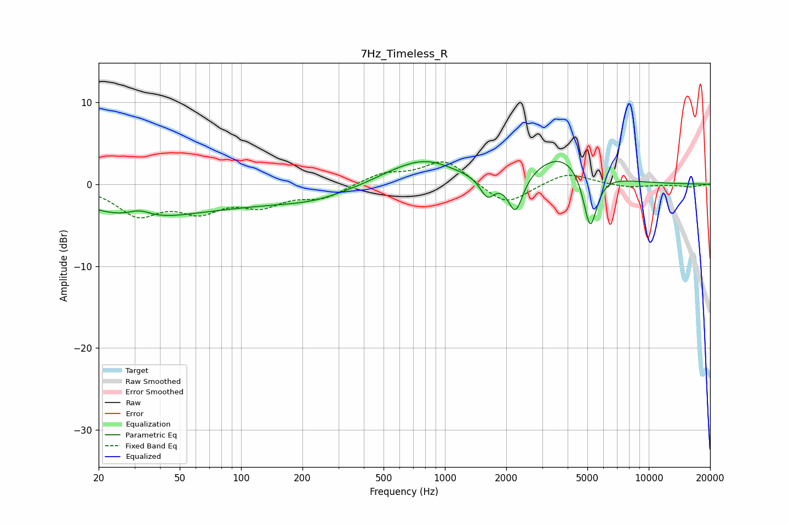

# 7Hz_Timeless_R
See [usage instructions](https://github.com/jaakkopasanen/AutoEq#usage) for more options and info.

### Parametric EQs
Apply preamp of -2.9 dB when using parametric equalizer.

|   # | Type    |   Fc (Hz) |    Q |   Gain (dB) |
|-----|---------|-----------|------|-------------|
|   1 | Peaking |        29 | 0.58 |        -2.3 |
|   2 | Peaking |        32 | 2.52 |         1   |
|   3 | Peaking |        73 | 0.26 |        -2.4 |
|   4 | Peaking |       227 | 0.95 |        -0.7 |
|   5 | Peaking |       541 | 1.14 |         0.6 |
|   6 | Peaking |       801 | 0.96 |         2.8 |
|   7 | Peaking |      1617 | 3.94 |        -2.5 |
|   8 | Peaking |      2220 | 3.79 |        -4.7 |
|   9 | Peaking |      3747 | 1.01 |         3.7 |
|  10 | Peaking |      5162 | 4.09 |        -7.3 |

### Fixed Band EQs
When using fixed band (also called graphic) equalizer, apply preamp of **-2.8 dB** (if available) and set gains manually with these parameters.

|   # | Type    |   Fc (Hz) |    Q |   Gain (dB) |
|-----|---------|-----------|------|-------------|
|   1 | Peaking |        31 | 1.41 |        -3.5 |
|   2 | Peaking |        62 | 1.41 |        -2.8 |
|   3 | Peaking |       125 | 1.41 |        -2.2 |
|   4 | Peaking |       250 | 1.41 |        -1.5 |
|   5 | Peaking |       500 | 1.41 |         1.3 |
|   6 | Peaking |      1000 | 1.41 |         3   |
|   7 | Peaking |      2000 | 1.41 |        -2.7 |
|   8 | Peaking |      4000 | 1.41 |         1.5 |
|   9 | Peaking |      8000 | 1.41 |        -0.4 |
|  10 | Peaking |     16000 | 1.41 |        -0.3 |

### Graphs

