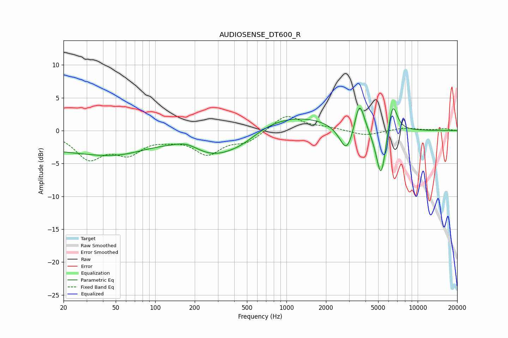

# AUDIOSENSE_DT600_R
See [usage instructions](https://github.com/jaakkopasanen/AutoEq#usage) for more options and info.

### Parametric EQs
Apply preamp of -3.5 dB when using parametric equalizer.

|   # | Type    |   Fc (Hz) |    Q |   Gain (dB) |
|-----|---------|-----------|------|-------------|
|   1 | Peaking |        22 | 0.29 |        -2.8 |
|   2 | Peaking |        55 | 0.65 |        -1.4 |
|   3 | Peaking |       173 | 1.56 |         1   |
|   4 | Peaking |       286 | 0.68 |        -3.9 |
|   5 | Peaking |       470 | 1.15 |        -1.1 |
|   6 | Peaking |      1003 | 0.4  |         2.6 |
|   7 | Peaking |      2878 | 2.6  |        -4.4 |
|   8 | Peaking |      3603 | 3.76 |         5   |
|   9 | Peaking |      5264 | 3.55 |        -8.1 |
|  10 | Peaking |      6423 | 3.71 |         5.2 |

### Fixed Band EQs
When using fixed band (also called graphic) equalizer, apply preamp of **-2.2 dB** (if available) and set gains manually with these parameters.

|   # | Type    |   Fc (Hz) |    Q |   Gain (dB) |
|-----|---------|-----------|------|-------------|
|   1 | Peaking |        31 | 1.41 |        -4   |
|   2 | Peaking |        62 | 1.41 |        -3   |
|   3 | Peaking |       125 | 1.41 |        -0.7 |
|   4 | Peaking |       250 | 1.41 |        -3.3 |
|   5 | Peaking |       500 | 1.41 |        -1.6 |
|   6 | Peaking |      1000 | 1.41 |         2.5 |
|   7 | Peaking |      2000 | 1.41 |         0.4 |
|   8 | Peaking |      4000 | 1.41 |        -0.8 |
|   9 | Peaking |      8000 | 1.41 |         0.4 |
|  10 | Peaking |     16000 | 1.41 |         0.3 |

### Graphs

