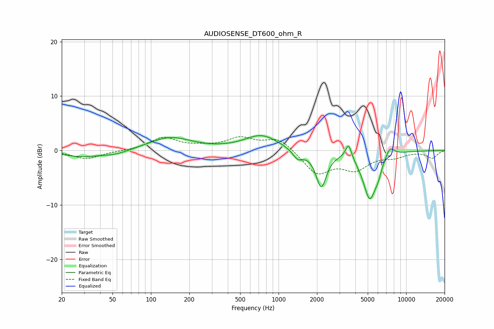

# AUDIOSENSE_DT600_ohm_R
See [usage instructions](https://github.com/jaakkopasanen/AutoEq#usage) for more options and info.

### Parametric EQs
Apply preamp of -2.8 dB when using parametric equalizer.

|   # | Type    |   Fc (Hz) |    Q |   Gain (dB) |
|-----|---------|-----------|------|-------------|
|   1 | Peaking |        28 | 0.96 |        -1.1 |
|   2 | Peaking |        52 | 1.32 |        -0.7 |
|   3 | Peaking |       141 | 0.86 |         2.4 |
|   4 | Peaking |       734 | 1.06 |         2.8 |
|   5 | Peaking |      1415 | 3.49 |        -1.7 |
|   6 | Peaking |      2159 | 3.4  |        -6.6 |
|   7 | Peaking |      3536 | 5.8  |         2.8 |
|   8 | Peaking |      5189 | 2.59 |        -8.7 |
|   9 | Peaking |      6040 | 5.66 |        -1.4 |
|  10 | Peaking |      7459 | 3.83 |         1.9 |

### Fixed Band EQs
When using fixed band (also called graphic) equalizer, apply preamp of **-2.6 dB** (if available) and set gains manually with these parameters.

|   # | Type    |   Fc (Hz) |    Q |   Gain (dB) |
|-----|---------|-----------|------|-------------|
|   1 | Peaking |        31 | 1.41 |        -1.5 |
|   2 | Peaking |        62 | 1.41 |        -0.1 |
|   3 | Peaking |       125 | 1.41 |         2.3 |
|   4 | Peaking |       250 | 1.41 |         0.5 |
|   5 | Peaking |       500 | 1.41 |         2.1 |
|   6 | Peaking |      1000 | 1.41 |         2.3 |
|   7 | Peaking |      2000 | 1.41 |        -4.2 |
|   8 | Peaking |      4000 | 1.41 |        -3.1 |
|   9 | Peaking |      8000 | 1.41 |        -1   |
|  10 | Peaking |     16000 | 1.41 |        -1.4 |

### Graphs

