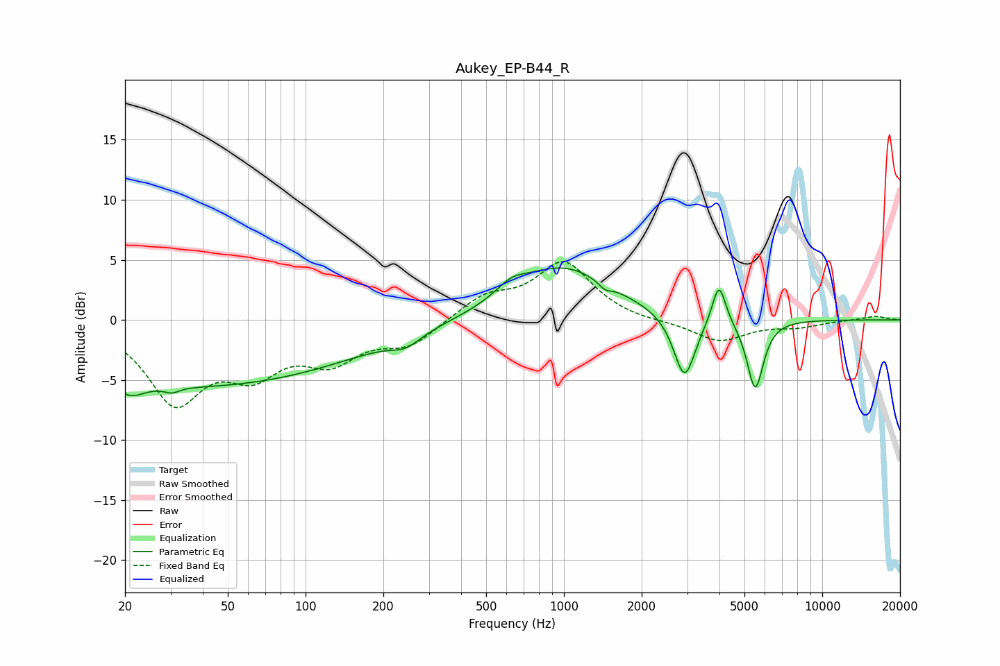

# Aukey_EP-B44_R
See [usage instructions](https://github.com/jaakkopasanen/AutoEq#usage) for more options and info.

### Parametric EQs
Apply preamp of -4.4 dB when using parametric equalizer.

|   # | Type    |   Fc (Hz) |    Q |   Gain (dB) |
|-----|---------|-----------|------|-------------|
|   1 | Peaking |        21 | 2.77 |        -1.1 |
|   2 | Peaking |        30 | 5.16 |        -0.4 |
|   3 | Peaking |        36 | 0.21 |        -5.5 |
|   4 | Peaking |       244 | 2.43 |        -0.9 |
|   5 | Peaking |       625 | 2.43 |         1   |
|   6 | Peaking |       987 | 0.74 |         4.4 |
|   7 | Peaking |      1442 | 5.87 |        -0.5 |
|   8 | Peaking |      2930 | 3.39 |        -5.4 |
|   9 | Peaking |      3982 | 5.36 |         3.6 |
|  10 | Peaking |      5502 | 4.39 |        -5.9 |

### Fixed Band EQs
When using fixed band (also called graphic) equalizer, apply preamp of **-4.9 dB** (if available) and set gains manually with these parameters.

|   # | Type    |   Fc (Hz) |    Q |   Gain (dB) |
|-----|---------|-----------|------|-------------|
|   1 | Peaking |        31 | 1.41 |        -6.5 |
|   2 | Peaking |        62 | 1.41 |        -3.6 |
|   3 | Peaking |       125 | 1.41 |        -2.9 |
|   4 | Peaking |       250 | 1.41 |        -2   |
|   5 | Peaking |       500 | 1.41 |         1.8 |
|   6 | Peaking |      1000 | 1.41 |         4.7 |
|   7 | Peaking |      2000 | 1.41 |        -0.2 |
|   8 | Peaking |      4000 | 1.41 |        -1.8 |
|   9 | Peaking |      8000 | 1.41 |        -0.5 |
|  10 | Peaking |     16000 | 1.41 |         0.3 |

### Graphs

