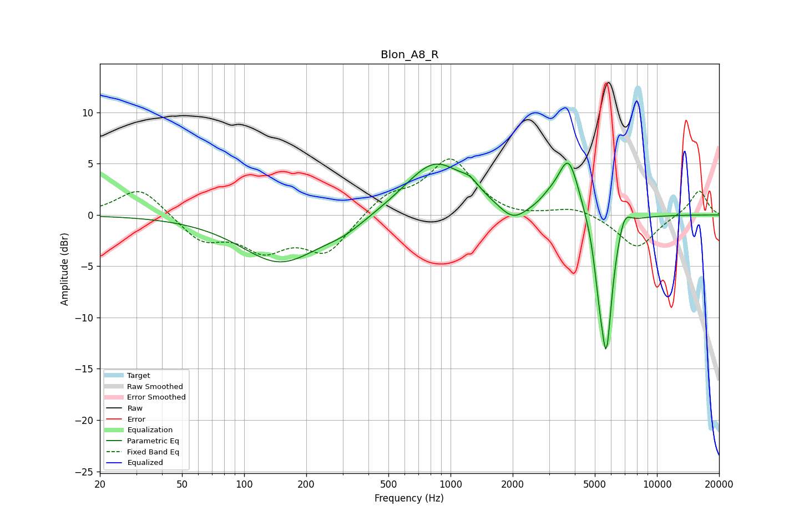

# Blon_A8_R
See [usage instructions](https://github.com/jaakkopasanen/AutoEq#usage) for more options and info.

### Parametric EQs
Apply preamp of -5.1 dB when using parametric equalizer.

|   # | Type    |   Fc (Hz) |    Q |   Gain (dB) |
|-----|---------|-----------|------|-------------|
|   1 | Peaking |       150 | 0.75 |        -4.6 |
|   2 | Peaking |       306 | 1.35 |        -0.9 |
|   3 | Peaking |       843 | 0.96 |         5.2 |
|   4 | Peaking |      1241 | 3.42 |         0.8 |
|   5 | Peaking |      2001 | 2.19 |        -1.6 |
|   6 | Peaking |      3011 | 3    |         0.7 |
|   7 | Peaking |      3731 | 2.72 |         5.6 |
|   8 | Peaking |      5237 | 6    |        -3.1 |
|   9 | Peaking |      5686 | 4.7  |       -12.9 |
|  10 | Peaking |      6944 | 4.39 |         1.8 |

### Fixed Band EQs
When using fixed band (also called graphic) equalizer, apply preamp of **-5.6 dB** (if available) and set gains manually with these parameters.

|   # | Type    |   Fc (Hz) |    Q |   Gain (dB) |
|-----|---------|-----------|------|-------------|
|   1 | Peaking |        31 | 1.41 |         2.8 |
|   2 | Peaking |        62 | 1.41 |        -2.4 |
|   3 | Peaking |       125 | 1.41 |        -3   |
|   4 | Peaking |       250 | 1.41 |        -3.6 |
|   5 | Peaking |       500 | 1.41 |         1.9 |
|   6 | Peaking |      1000 | 1.41 |         5.3 |
|   7 | Peaking |      2000 | 1.41 |        -0.4 |
|   8 | Peaking |      4000 | 1.41 |         0.8 |
|   9 | Peaking |      8000 | 1.41 |        -3.3 |
|  10 | Peaking |     16000 | 1.41 |         2.5 |

### Graphs

