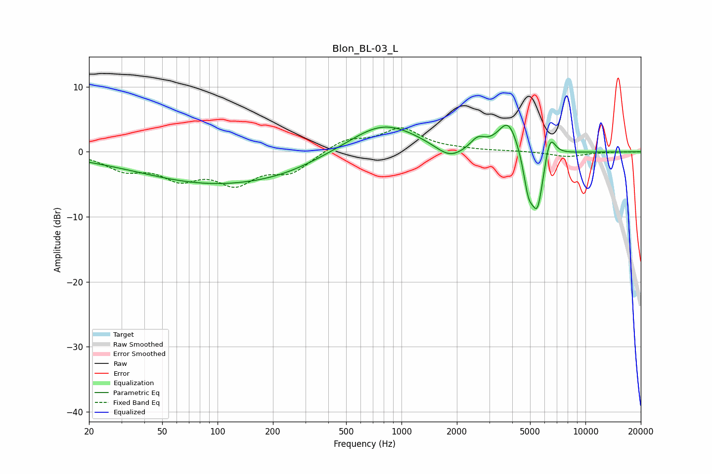

# Blon_BL-03_L
See [usage instructions](https://github.com/jaakkopasanen/AutoEq#usage) for more options and info.

### Parametric EQs
Apply preamp of -4.2 dB when using parametric equalizer.

|   # | Type    |   Fc (Hz) |    Q |   Gain (dB) |
|-----|---------|-----------|------|-------------|
|   1 | Peaking |        21 | 0.7  |        -0.2 |
|   2 | Peaking |        99 | 0.34 |        -4.8 |
|   3 | Peaking |       237 | 0.77 |        -0.6 |
|   4 | Peaking |       798 | 0.75 |         4.6 |
|   5 | Peaking |      1830 | 1.78 |        -2.1 |
|   6 | Peaking |      2595 | 3.56 |         1.6 |
|   7 | Peaking |      3811 | 2.49 |         5.1 |
|   8 | Peaking |      4895 | 5.08 |        -5   |
|   9 | Peaking |      5489 | 3.96 |        -9   |
|  10 | Peaking |      6404 | 4.52 |         4.3 |

### Fixed Band EQs
When using fixed band (also called graphic) equalizer, apply preamp of **-3.8 dB** (if available) and set gains manually with these parameters.

|   # | Type    |   Fc (Hz) |    Q |   Gain (dB) |
|-----|---------|-----------|------|-------------|
|   1 | Peaking |        31 | 1.41 |        -2.4 |
|   2 | Peaking |        62 | 1.41 |        -3.5 |
|   3 | Peaking |       125 | 1.41 |        -4.3 |
|   4 | Peaking |       250 | 1.41 |        -2.9 |
|   5 | Peaking |       500 | 1.41 |         1.9 |
|   6 | Peaking |      1000 | 1.41 |         3.4 |
|   7 | Peaking |      2000 | 1.41 |         0.2 |
|   8 | Peaking |      4000 | 1.41 |         0.1 |
|   9 | Peaking |      8000 | 1.41 |        -0.8 |
|  10 | Peaking |     16000 | 1.41 |         0   |

### Graphs

