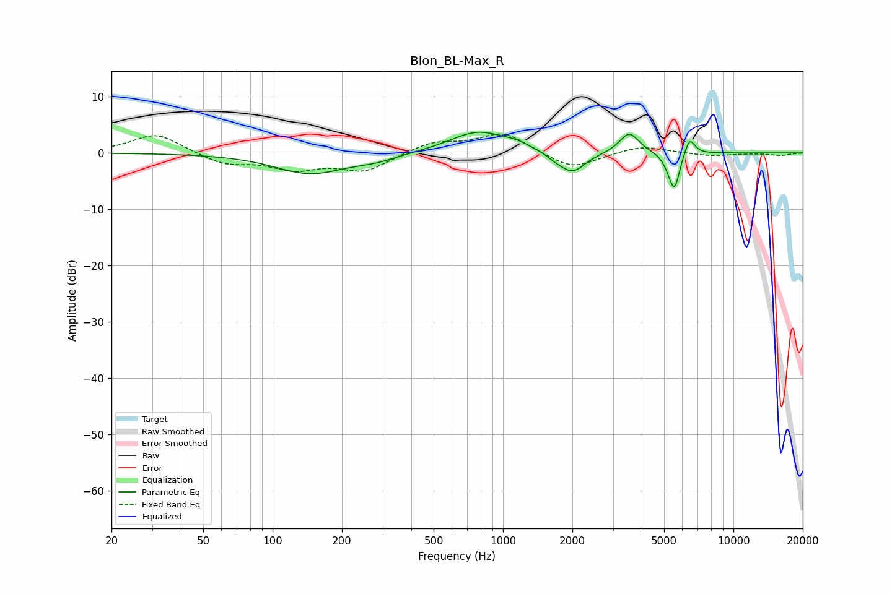

# Blon_BL-Max_R
See [usage instructions](https://github.com/jaakkopasanen/AutoEq#usage) for more options and info.

### Parametric EQs
Apply preamp of -3.8 dB when using parametric equalizer.

|   # | Type    |   Fc (Hz) |    Q |   Gain (dB) |
|-----|---------|-----------|------|-------------|
|   1 | Peaking |       146 | 0.92 |        -3.6 |
|   2 | Peaking |       282 | 1.5  |        -0.9 |
|   3 | Peaking |       780 | 1.14 |         3.9 |
|   4 | Peaking |      1145 | 2.49 |         0.7 |
|   5 | Peaking |      1681 | 4.03 |        -0.6 |
|   6 | Peaking |      1999 | 2.47 |        -3.7 |
|   7 | Peaking |      3531 | 3.33 |         3.7 |
|   8 | Peaking |      5268 | 5.49 |        -1.2 |
|   9 | Peaking |      5556 | 6    |        -6   |
|  10 | Peaking |      6450 | 5.97 |         3.2 |

### Fixed Band EQs
When using fixed band (also called graphic) equalizer, apply preamp of **-3.5 dB** (if available) and set gains manually with these parameters.

|   # | Type    |   Fc (Hz) |    Q |   Gain (dB) |
|-----|---------|-----------|------|-------------|
|   1 | Peaking |        31 | 1.41 |         3.5 |
|   2 | Peaking |        62 | 1.41 |        -2   |
|   3 | Peaking |       125 | 1.41 |        -2.6 |
|   4 | Peaking |       250 | 1.41 |        -3.1 |
|   5 | Peaking |       500 | 1.41 |         1.9 |
|   6 | Peaking |      1000 | 1.41 |         3.6 |
|   7 | Peaking |      2000 | 1.41 |        -3   |
|   8 | Peaking |      4000 | 1.41 |         1.4 |
|   9 | Peaking |      8000 | 1.41 |        -0.6 |
|  10 | Peaking |     16000 | 1.41 |        -0.4 |

### Graphs

