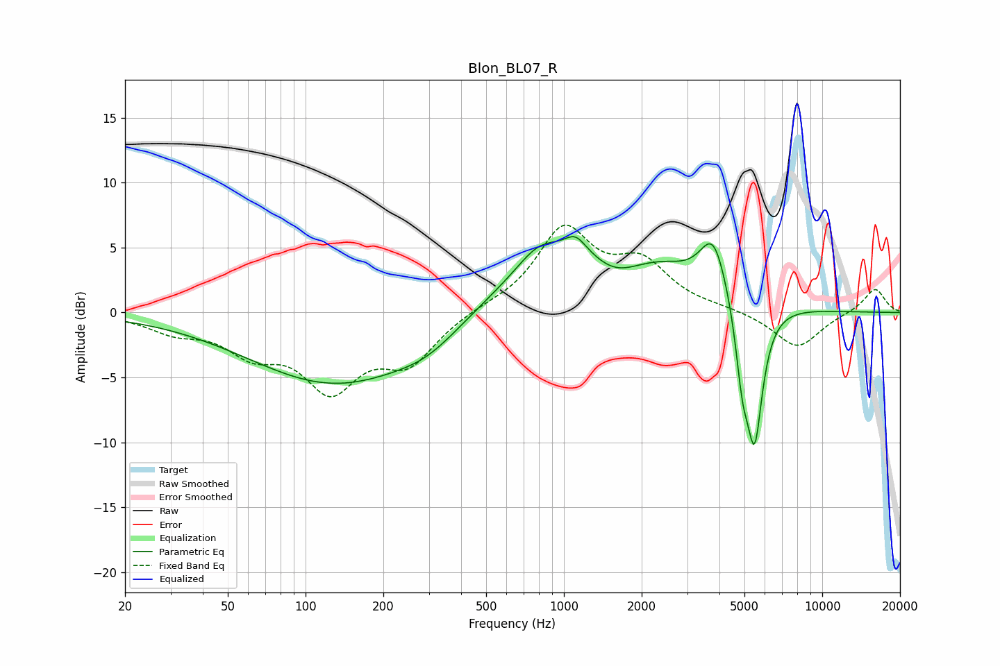

# Blon_BL07_R
See [usage instructions](https://github.com/jaakkopasanen/AutoEq#usage) for more options and info.

### Parametric EQs
Apply preamp of -5.9 dB when using parametric equalizer.

|   # | Type    |   Fc (Hz) |    Q |   Gain (dB) |
|-----|---------|-----------|------|-------------|
|   1 | Peaking |       133 | 0.41 |        -5.6 |
|   2 | Peaking |       298 | 1.13 |        -1.2 |
|   3 | Peaking |       797 | 1.77 |         1.6 |
|   4 | Peaking |      1109 | 3.47 |         1.2 |
|   5 | Peaking |      1256 | 0.44 |         5.4 |
|   6 | Peaking |      1571 | 1.45 |        -2   |
|   7 | Peaking |      2464 | 1.63 |         0.5 |
|   8 | Peaking |      3793 | 2.67 |         4.4 |
|   9 | Peaking |      4908 | 5.34 |        -4.6 |
|  10 | Peaking |      5473 | 4.31 |       -10.3 |

### Fixed Band EQs
When using fixed band (also called graphic) equalizer, apply preamp of **-6.8 dB** (if available) and set gains manually with these parameters.

|   # | Type    |   Fc (Hz) |    Q |   Gain (dB) |
|-----|---------|-----------|------|-------------|
|   1 | Peaking |        31 | 1.41 |        -1.2 |
|   2 | Peaking |        62 | 1.41 |        -2.6 |
|   3 | Peaking |       125 | 1.41 |        -5.4 |
|   4 | Peaking |       250 | 1.41 |        -3.5 |
|   5 | Peaking |       500 | 1.41 |         0.3 |
|   6 | Peaking |      1000 | 1.41 |         6.2 |
|   7 | Peaking |      2000 | 1.41 |         3.4 |
|   8 | Peaking |      4000 | 1.41 |         0.2 |
|   9 | Peaking |      8000 | 1.41 |        -2.8 |
|  10 | Peaking |     16000 | 1.41 |         1.9 |

### Graphs

