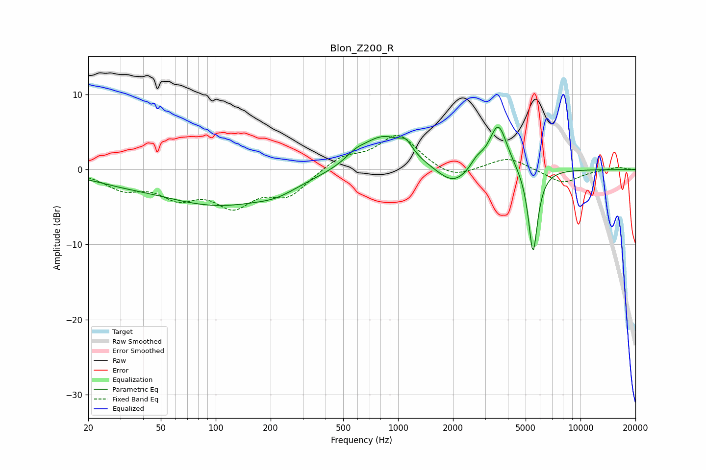

# Blon_Z200_R
See [usage instructions](https://github.com/jaakkopasanen/AutoEq#usage) for more options and info.

### Parametric EQs
Apply preamp of -5.8 dB when using parametric equalizer.

|   # | Type    |   Fc (Hz) |    Q |   Gain (dB) |
|-----|---------|-----------|------|-------------|
|   1 | Peaking |        30 | 0.78 |        -0.8 |
|   2 | Peaking |       104 | 0.43 |        -4.6 |
|   3 | Peaking |       216 | 1.33 |        -0.9 |
|   4 | Peaking |       584 | 2.71 |         0.8 |
|   5 | Peaking |       831 | 1.1  |         4.7 |
|   6 | Peaking |      1105 | 4.3  |         1.4 |
|   7 | Peaking |      2012 | 1.54 |        -2.6 |
|   8 | Peaking |      2703 | 3.95 |         1.2 |
|   9 | Peaking |      3541 | 2.82 |         6.3 |
|  10 | Peaking |      5492 | 5.38 |       -11.6 |

### Fixed Band EQs
When using fixed band (also called graphic) equalizer, apply preamp of **-4.6 dB** (if available) and set gains manually with these parameters.

|   # | Type    |   Fc (Hz) |    Q |   Gain (dB) |
|-----|---------|-----------|------|-------------|
|   1 | Peaking |        31 | 1.41 |        -2.2 |
|   2 | Peaking |        62 | 1.41 |        -3.1 |
|   3 | Peaking |       125 | 1.41 |        -4.3 |
|   4 | Peaking |       250 | 1.41 |        -3.2 |
|   5 | Peaking |       500 | 1.41 |         1.7 |
|   6 | Peaking |      1000 | 1.41 |         4.6 |
|   7 | Peaking |      2000 | 1.41 |        -1.4 |
|   8 | Peaking |      4000 | 1.41 |         1.7 |
|   9 | Peaking |      8000 | 1.41 |        -1.9 |
|  10 | Peaking |     16000 | 1.41 |         0.4 |

### Graphs

