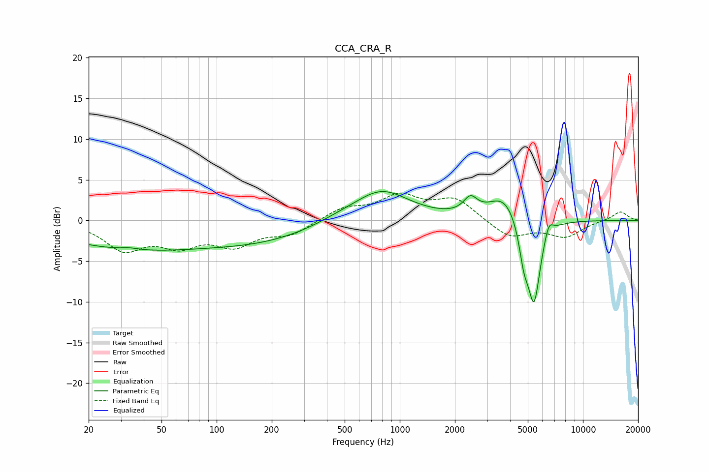

# CCA_CRA_R
See [usage instructions](https://github.com/jaakkopasanen/AutoEq#usage) for more options and info.

### Parametric EQs
Apply preamp of -3.6 dB when using parametric equalizer.

|   # | Type    |   Fc (Hz) |    Q |   Gain (dB) |
|-----|---------|-----------|------|-------------|
|   1 | Peaking |        34 | 3.16 |         0.2 |
|   2 | Peaking |        35 | 0.33 |        -3.4 |
|   3 | Peaking |       183 | 0.49 |        -2   |
|   4 | Peaking |       455 | 1.23 |         0.4 |
|   5 | Peaking |       790 | 0.93 |         3.8 |
|   6 | Peaking |      2430 | 3.84 |         1.9 |
|   7 | Peaking |      3717 | 1.65 |         3.2 |
|   8 | Peaking |      4763 | 5.14 |        -3.8 |
|   9 | Peaking |      5408 | 3.92 |       -10.2 |
|  10 | Peaking |      6507 | 5.91 |         1.7 |

### Fixed Band EQs
When using fixed band (also called graphic) equalizer, apply preamp of **-3.5 dB** (if available) and set gains manually with these parameters.

|   # | Type    |   Fc (Hz) |    Q |   Gain (dB) |
|-----|---------|-----------|------|-------------|
|   1 | Peaking |        31 | 1.41 |        -3.4 |
|   2 | Peaking |        62 | 1.41 |        -2.6 |
|   3 | Peaking |       125 | 1.41 |        -2.7 |
|   4 | Peaking |       250 | 1.41 |        -1.6 |
|   5 | Peaking |       500 | 1.41 |         1.4 |
|   6 | Peaking |      1000 | 1.41 |         2.8 |
|   7 | Peaking |      2000 | 1.41 |         2.6 |
|   8 | Peaking |      4000 | 1.41 |        -2.1 |
|   9 | Peaking |      8000 | 1.41 |        -1.9 |
|  10 | Peaking |     16000 | 1.41 |         1.1 |

### Graphs

