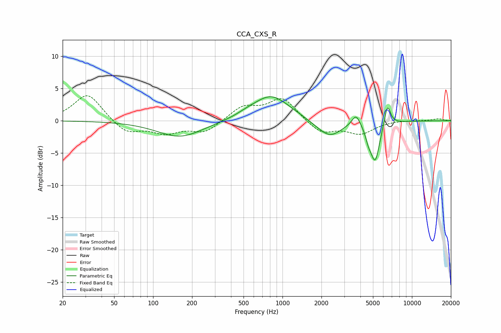

# CCA_CXS_R
See [usage instructions](https://github.com/jaakkopasanen/AutoEq#usage) for more options and info.

### Parametric EQs
Apply preamp of -3.8 dB when using parametric equalizer.

|   # | Type    |   Fc (Hz) |    Q |   Gain (dB) |
|-----|---------|-----------|------|-------------|
|   1 | Peaking |       162 | 0.81 |        -2.5 |
|   2 | Peaking |       531 | 1.71 |         0.4 |
|   3 | Peaking |       807 | 1.07 |         3.5 |
|   4 | Peaking |      1160 | 0.75 |         0.6 |
|   5 | Peaking |      1807 | 1.27 |        -0.6 |
|   6 | Peaking |      2337 | 1.61 |        -2.3 |
|   7 | Peaking |      3704 | 4.35 |         1.9 |
|   8 | Peaking |      4620 | 6    |        -1.5 |
|   9 | Peaking |      5203 | 3.91 |        -6   |
|  10 | Peaking |      6469 | 5.7  |         3.4 |

### Fixed Band EQs
When using fixed band (also called graphic) equalizer, apply preamp of **-4.0 dB** (if available) and set gains manually with these parameters.

|   # | Type    |   Fc (Hz) |    Q |   Gain (dB) |
|-----|---------|-----------|------|-------------|
|   1 | Peaking |        31 | 1.41 |         4.3 |
|   2 | Peaking |        62 | 1.41 |        -2   |
|   3 | Peaking |       125 | 1.41 |        -1.7 |
|   4 | Peaking |       250 | 1.41 |        -1.8 |
|   5 | Peaking |       500 | 1.41 |         2.1 |
|   6 | Peaking |      1000 | 1.41 |         3.5 |
|   7 | Peaking |      2000 | 1.41 |        -2   |
|   8 | Peaking |      4000 | 1.41 |        -1.9 |
|   9 | Peaking |      8000 | 1.41 |         0.1 |
|  10 | Peaking |     16000 | 1.41 |         0.3 |

### Graphs

