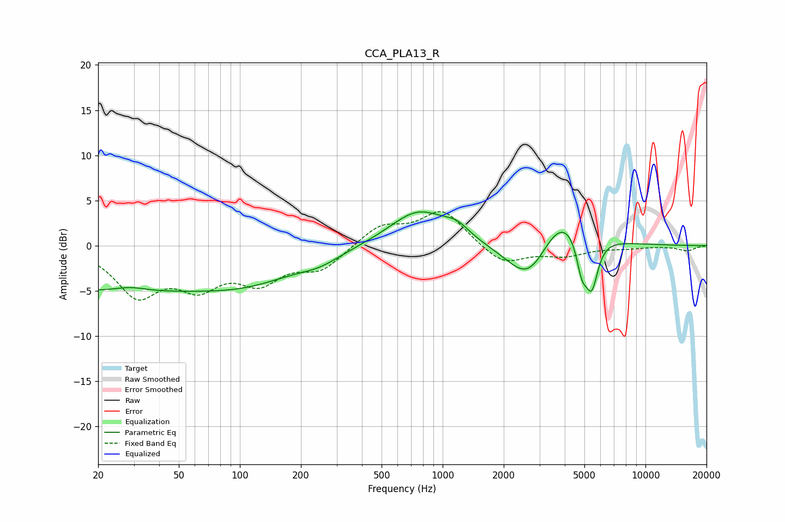

# CCA_PLA13_R
See [usage instructions](https://github.com/jaakkopasanen/AutoEq#usage) for more options and info.

### Parametric EQs
Apply preamp of -3.8 dB when using parametric equalizer.

|   # | Type    |   Fc (Hz) |    Q |   Gain (dB) |
|-----|---------|-----------|------|-------------|
|   1 | Peaking |        20 | 0.25 |        -4.8 |
|   2 | Peaking |        29 | 1.74 |         0.6 |
|   3 | Peaking |       114 | 0.55 |        -2.8 |
|   4 | Peaking |       248 | 1.39 |        -0.9 |
|   5 | Peaking |       761 | 0.99 |         4   |
|   6 | Peaking |      1175 | 2.34 |         1.2 |
|   7 | Peaking |      2673 | 1.28 |        -5.5 |
|   8 | Peaking |      3825 | 1.13 |         5.1 |
|   9 | Peaking |      4854 | 5.09 |        -3.7 |
|  10 | Peaking |      5432 | 4.4  |        -5.4 |

### Fixed Band EQs
When using fixed band (also called graphic) equalizer, apply preamp of **-3.9 dB** (if available) and set gains manually with these parameters.

|   # | Type    |   Fc (Hz) |    Q |   Gain (dB) |
|-----|---------|-----------|------|-------------|
|   1 | Peaking |        31 | 1.41 |        -5.2 |
|   2 | Peaking |        62 | 1.41 |        -3.8 |
|   3 | Peaking |       125 | 1.41 |        -3.5 |
|   4 | Peaking |       250 | 1.41 |        -2.4 |
|   5 | Peaking |       500 | 1.41 |         2.2 |
|   6 | Peaking |      1000 | 1.41 |         3.9 |
|   7 | Peaking |      2000 | 1.41 |        -2.2 |
|   8 | Peaking |      4000 | 1.41 |        -1   |
|   9 | Peaking |      8000 | 1.41 |        -0.2 |
|  10 | Peaking |     16000 | 1.41 |        -0.5 |

### Graphs

