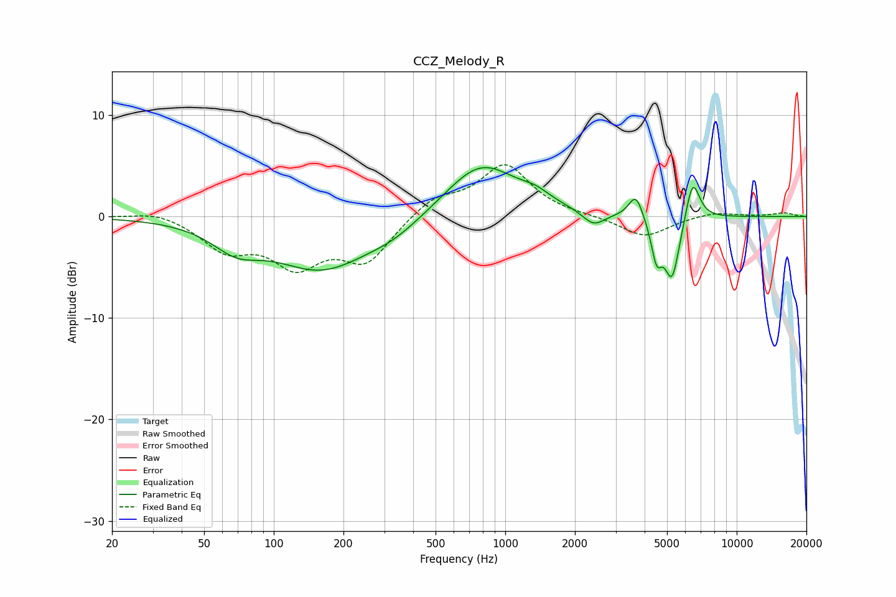

# CCZ_Melody_R
See [usage instructions](https://github.com/jaakkopasanen/AutoEq#usage) for more options and info.

### Parametric EQs
Apply preamp of -4.9 dB when using parametric equalizer.

|   # | Type    |   Fc (Hz) |    Q |   Gain (dB) |
|-----|---------|-----------|------|-------------|
|   1 | Peaking |        69 | 1.36 |        -2.2 |
|   2 | Peaking |       161 | 0.68 |        -5   |
|   3 | Peaking |       329 | 1.11 |        -1.2 |
|   4 | Peaking |       786 | 0.9  |         5.4 |
|   5 | Peaking |      1354 | 2.25 |         0.8 |
|   6 | Peaking |      2408 | 2.93 |        -1.4 |
|   7 | Peaking |      3667 | 4.61 |         2.4 |
|   8 | Peaking |      4507 | 5.97 |        -3.6 |
|   9 | Peaking |      5257 | 4.18 |        -6.2 |
|  10 | Peaking |      6451 | 4.55 |         4.2 |

### Fixed Band EQs
When using fixed band (also called graphic) equalizer, apply preamp of **-5.2 dB** (if available) and set gains manually with these parameters.

|   # | Type    |   Fc (Hz) |    Q |   Gain (dB) |
|-----|---------|-----------|------|-------------|
|   1 | Peaking |        31 | 1.41 |         0.7 |
|   2 | Peaking |        62 | 1.41 |        -3   |
|   3 | Peaking |       125 | 1.41 |        -4.3 |
|   4 | Peaking |       250 | 1.41 |        -4.2 |
|   5 | Peaking |       500 | 1.41 |         1.8 |
|   6 | Peaking |      1000 | 1.41 |         5   |
|   7 | Peaking |      2000 | 1.41 |         0   |
|   8 | Peaking |      4000 | 1.41 |        -2.1 |
|   9 | Peaking |      8000 | 1.41 |         0.5 |
|  10 | Peaking |     16000 | 1.41 |         0.4 |

### Graphs

