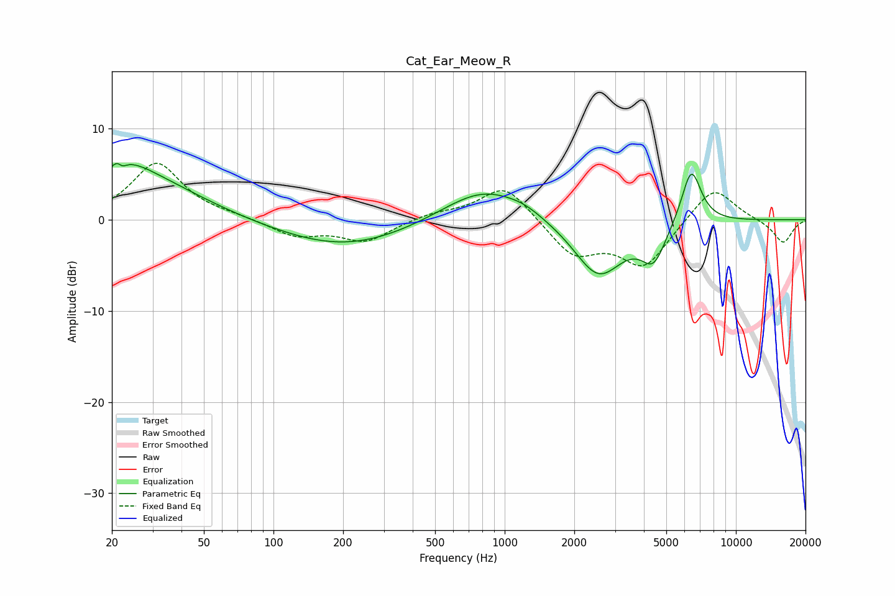

# Cat_Ear_Meow_R
See [usage instructions](https://github.com/jaakkopasanen/AutoEq#usage) for more options and info.

### Parametric EQs
Apply preamp of -6.2 dB when using parametric equalizer.

|   # | Type    |   Fc (Hz) |    Q |   Gain (dB) |
|-----|---------|-----------|------|-------------|
|   1 | Peaking |        22 | 4.99 |         3.9 |
|   2 | Peaking |        22 | 5.99 |        -3.2 |
|   3 | Peaking |        25 | 1.63 |         1.2 |
|   4 | Peaking |        26 | 0.56 |         4.6 |
|   5 | Peaking |       204 | 0.48 |        -3.1 |
|   6 | Peaking |       818 | 0.77 |         3.9 |
|   7 | Peaking |      1217 | 2.08 |         0.4 |
|   8 | Peaking |      2544 | 1.3  |        -6.3 |
|   9 | Peaking |      4406 | 2.65 |        -3.8 |
|  10 | Peaking |      6411 | 3.14 |         6.2 |

### Fixed Band EQs
When using fixed band (also called graphic) equalizer, apply preamp of **-6.3 dB** (if available) and set gains manually with these parameters.

|   # | Type    |   Fc (Hz) |    Q |   Gain (dB) |
|-----|---------|-----------|------|-------------|
|   1 | Peaking |        31 | 1.41 |         6.2 |
|   2 | Peaking |        62 | 1.41 |         0.3 |
|   3 | Peaking |       125 | 1.41 |        -1.7 |
|   4 | Peaking |       250 | 1.41 |        -2.3 |
|   5 | Peaking |       500 | 1.41 |         0.7 |
|   6 | Peaking |      1000 | 1.41 |         3.9 |
|   7 | Peaking |      2000 | 1.41 |        -3.8 |
|   8 | Peaking |      4000 | 1.41 |        -5   |
|   9 | Peaking |      8000 | 1.41 |         3.9 |
|  10 | Peaking |     16000 | 1.41 |        -2.6 |

### Graphs

