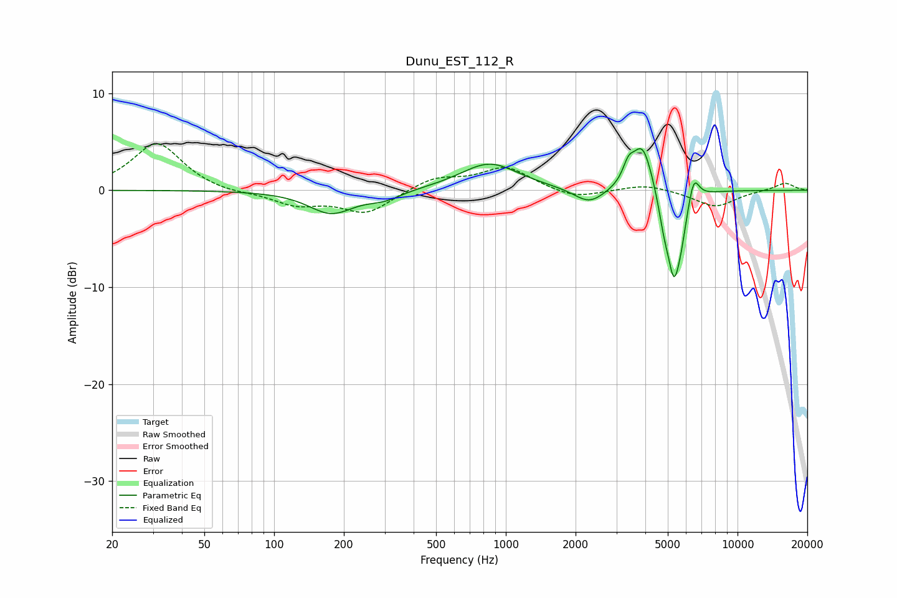

# Dunu_EST_112_R
See [usage instructions](https://github.com/jaakkopasanen/AutoEq#usage) for more options and info.

### Parametric EQs
Apply preamp of -4.4 dB when using parametric equalizer.

|   # | Type    |   Fc (Hz) |    Q |   Gain (dB) |
|-----|---------|-----------|------|-------------|
|   1 | Peaking |       176 | 1.46 |        -2.4 |
|   2 | Peaking |       299 | 1.93 |        -0.8 |
|   3 | Peaking |       850 | 1.13 |         2.8 |
|   4 | Peaking |      2294 | 2.15 |        -1.6 |
|   5 | Peaking |      3382 | 5.99 |         1.7 |
|   6 | Peaking |      3891 | 3.18 |         5   |
|   7 | Peaking |      4807 | 6    |        -2.2 |
|   8 | Peaking |      5316 | 4.6  |        -8.4 |
|   9 | Peaking |      5729 | 6    |        -2   |
|  10 | Peaking |      6473 | 5.97 |         2.6 |

### Fixed Band EQs
When using fixed band (also called graphic) equalizer, apply preamp of **-4.9 dB** (if available) and set gains manually with these parameters.

|   # | Type    |   Fc (Hz) |    Q |   Gain (dB) |
|-----|---------|-----------|------|-------------|
|   1 | Peaking |        31 | 1.41 |         4.9 |
|   2 | Peaking |        62 | 1.41 |        -0.4 |
|   3 | Peaking |       125 | 1.41 |        -1.4 |
|   4 | Peaking |       250 | 1.41 |        -2.3 |
|   5 | Peaking |       500 | 1.41 |         1.3 |
|   6 | Peaking |      1000 | 1.41 |         2.3 |
|   7 | Peaking |      2000 | 1.41 |        -0.9 |
|   8 | Peaking |      4000 | 1.41 |         0.7 |
|   9 | Peaking |      8000 | 1.41 |        -1.7 |
|  10 | Peaking |     16000 | 1.41 |         0.8 |

### Graphs

