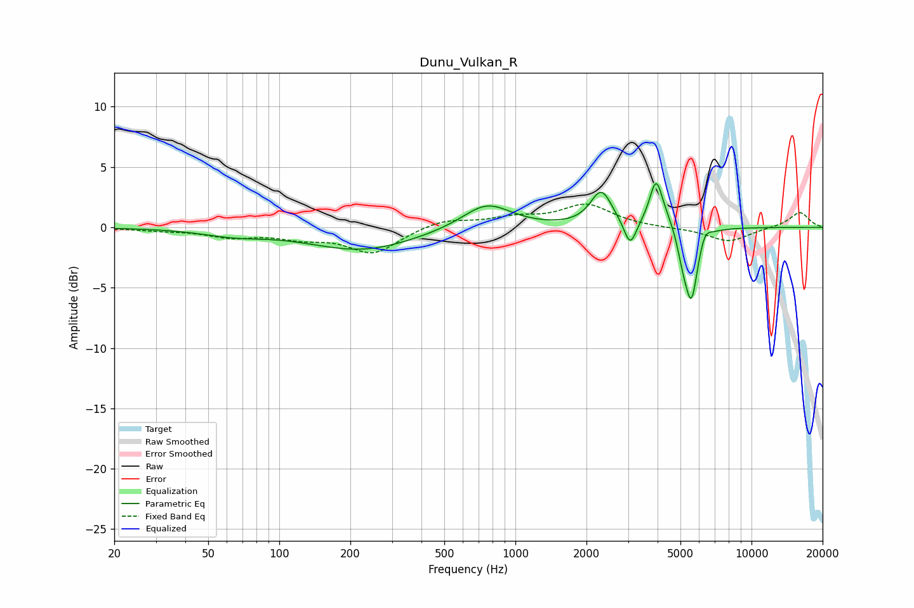

# Dunu_Vulkan_R
See [usage instructions](https://github.com/jaakkopasanen/AutoEq#usage) for more options and info.

### Parametric EQs
Apply preamp of -3.7 dB when using parametric equalizer.

|   # | Type    |   Fc (Hz) |    Q |   Gain (dB) |
|-----|---------|-----------|------|-------------|
|   1 | Peaking |        64 | 1.06 |        -0.5 |
|   2 | Peaking |       224 | 0.63 |        -1.9 |
|   3 | Peaking |       756 | 1.37 |         2.1 |
|   4 | Peaking |      2311 | 3.1  |         2.9 |
|   5 | Peaking |      3063 | 5.47 |        -2.2 |
|   6 | Peaking |      3942 | 5.13 |         3.7 |
|   7 | Peaking |      4390 | 2.98 |         0.7 |
|   8 | Peaking |      5113 | 6    |        -1.7 |
|   9 | Peaking |      5565 | 5.2  |        -5.8 |
|  10 | Peaking |      6345 | 6    |         0.9 |

### Fixed Band EQs
When using fixed band (also called graphic) equalizer, apply preamp of **-2.0 dB** (if available) and set gains manually with these parameters.

|   # | Type    |   Fc (Hz) |    Q |   Gain (dB) |
|-----|---------|-----------|------|-------------|
|   1 | Peaking |        31 | 1.41 |        -0.2 |
|   2 | Peaking |        62 | 1.41 |        -0.7 |
|   3 | Peaking |       125 | 1.41 |        -0.7 |
|   4 | Peaking |       250 | 1.41 |        -2.1 |
|   5 | Peaking |       500 | 1.41 |         0.7 |
|   6 | Peaking |      1000 | 1.41 |         0.7 |
|   7 | Peaking |      2000 | 1.41 |         1.8 |
|   8 | Peaking |      4000 | 1.41 |        -0   |
|   9 | Peaking |      8000 | 1.41 |        -1.2 |
|  10 | Peaking |     16000 | 1.41 |         1.3 |

### Graphs

