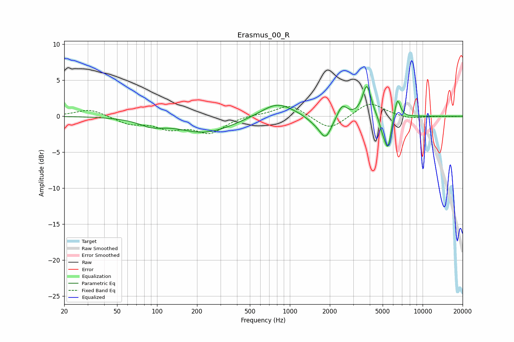

# Erasmus_00_R
See [usage instructions](https://github.com/jaakkopasanen/AutoEq#usage) for more options and info.

### Parametric EQs
Apply preamp of -4.2 dB when using parametric equalizer.

|   # | Type    |   Fc (Hz) |    Q |   Gain (dB) |
|-----|---------|-----------|------|-------------|
|   1 | Peaking |        91 | 1.53 |        -0.9 |
|   2 | Peaking |       230 | 0.67 |        -2.3 |
|   3 | Peaking |       803 | 1.16 |         2.1 |
|   4 | Peaking |      1518 | 2.24 |        -0.6 |
|   5 | Peaking |      1859 | 3    |        -3   |
|   6 | Peaking |      2481 | 3.87 |         1.8 |
|   7 | Peaking |      3801 | 4.37 |         4.4 |
|   8 | Peaking |      4978 | 5.99 |        -1.2 |
|   9 | Peaking |      5468 | 5.2  |        -4.5 |
|  10 | Peaking |      6453 | 6    |         2.9 |

### Fixed Band EQs
When using fixed band (also called graphic) equalizer, apply preamp of **-1.8 dB** (if available) and set gains manually with these parameters.

|   # | Type    |   Fc (Hz) |    Q |   Gain (dB) |
|-----|---------|-----------|------|-------------|
|   1 | Peaking |        31 | 1.41 |         1   |
|   2 | Peaking |        62 | 1.41 |        -1   |
|   3 | Peaking |       125 | 1.41 |        -1.5 |
|   4 | Peaking |       250 | 1.41 |        -2.2 |
|   5 | Peaking |       500 | 1.41 |         0.2 |
|   6 | Peaking |      1000 | 1.41 |         1.7 |
|   7 | Peaking |      2000 | 1.41 |        -2   |
|   8 | Peaking |      4000 | 1.41 |         2   |
|   9 | Peaking |      8000 | 1.41 |        -0.4 |
|  10 | Peaking |     16000 | 1.41 |        -0   |

### Graphs

