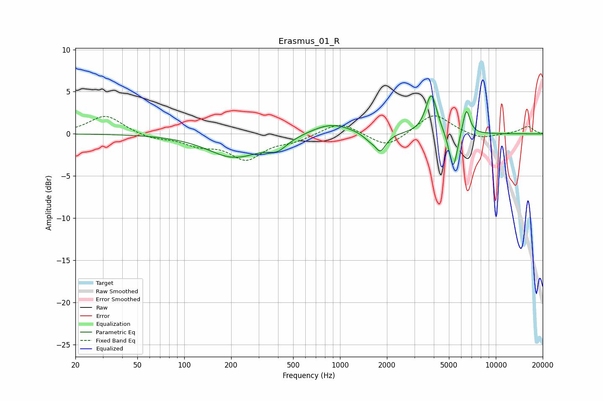

# Erasmus_01_R
See [usage instructions](https://github.com/jaakkopasanen/AutoEq#usage) for more options and info.

### Parametric EQs
Apply preamp of -4.6 dB when using parametric equalizer.

|   # | Type    |   Fc (Hz) |    Q |   Gain (dB) |
|-----|---------|-----------|------|-------------|
|   1 | Peaking |       211 | 0.85 |        -2.8 |
|   2 | Peaking |       221 | 2.08 |         0.1 |
|   3 | Peaking |       397 | 2.33 |        -1.2 |
|   4 | Peaking |       874 | 1.07 |         1.4 |
|   5 | Peaking |      1579 | 2.95 |        -0.9 |
|   6 | Peaking |      1722 | 3.84 |         1.1 |
|   7 | Peaking |      1793 | 3.8  |        -2.8 |
|   8 | Peaking |      3857 | 3.92 |         4.8 |
|   9 | Peaking |      5325 | 5.18 |        -4.6 |
|  10 | Peaking |      6469 | 5.88 |         3.2 |

### Fixed Band EQs
When using fixed band (also called graphic) equalizer, apply preamp of **-2.2 dB** (if available) and set gains manually with these parameters.

|   # | Type    |   Fc (Hz) |    Q |   Gain (dB) |
|-----|---------|-----------|------|-------------|
|   1 | Peaking |        31 | 1.41 |         2.2 |
|   2 | Peaking |        62 | 1.41 |        -0.6 |
|   3 | Peaking |       125 | 1.41 |        -1.1 |
|   4 | Peaking |       250 | 1.41 |        -2.8 |
|   5 | Peaking |       500 | 1.41 |        -0.7 |
|   6 | Peaking |      1000 | 1.41 |         1.5 |
|   7 | Peaking |      2000 | 1.41 |        -1.7 |
|   8 | Peaking |      4000 | 1.41 |         2.5 |
|   9 | Peaking |      8000 | 1.41 |        -0.7 |
|  10 | Peaking |     16000 | 1.41 |         0.9 |

### Graphs

