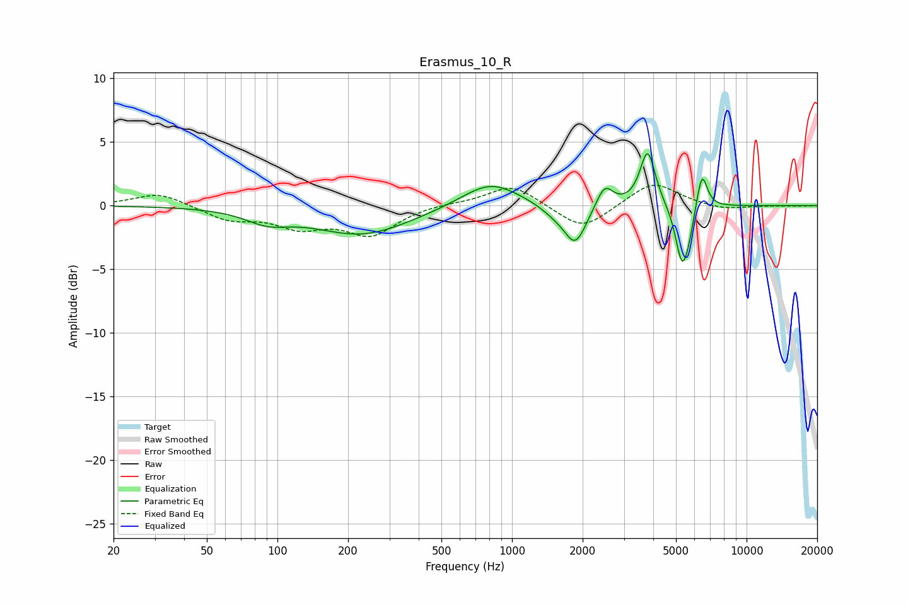

# Erasmus_10_R
See [usage instructions](https://github.com/jaakkopasanen/AutoEq#usage) for more options and info.

### Parametric EQs
Apply preamp of -4.2 dB when using parametric equalizer.

|   # | Type    |   Fc (Hz) |    Q |   Gain (dB) |
|-----|---------|-----------|------|-------------|
|   1 | Peaking |        90 | 1.54 |        -0.9 |
|   2 | Peaking |       230 | 0.68 |        -2.3 |
|   3 | Peaking |       808 | 1.15 |         2   |
|   4 | Peaking |      1522 | 2.23 |        -0.6 |
|   5 | Peaking |      1862 | 2.97 |        -3   |
|   6 | Peaking |      2480 | 3.97 |         1.8 |
|   7 | Peaking |      3788 | 4.36 |         4.4 |
|   8 | Peaking |      5305 | 4.96 |        -4.5 |
|   9 | Peaking |      5680 | 6    |        -1.2 |
|  10 | Peaking |      6453 | 6    |         3   |

### Fixed Band EQs
When using fixed band (also called graphic) equalizer, apply preamp of **-1.7 dB** (if available) and set gains manually with these parameters.

|   # | Type    |   Fc (Hz) |    Q |   Gain (dB) |
|-----|---------|-----------|------|-------------|
|   1 | Peaking |        31 | 1.41 |         1   |
|   2 | Peaking |        62 | 1.41 |        -1   |
|   3 | Peaking |       125 | 1.41 |        -1.5 |
|   4 | Peaking |       250 | 1.41 |        -2.2 |
|   5 | Peaking |       500 | 1.41 |         0.2 |
|   6 | Peaking |      1000 | 1.41 |         1.7 |
|   7 | Peaking |      2000 | 1.41 |        -2   |
|   8 | Peaking |      4000 | 1.41 |         1.9 |
|   9 | Peaking |      8000 | 1.41 |        -0.4 |
|  10 | Peaking |     16000 | 1.41 |        -0   |

### Graphs

