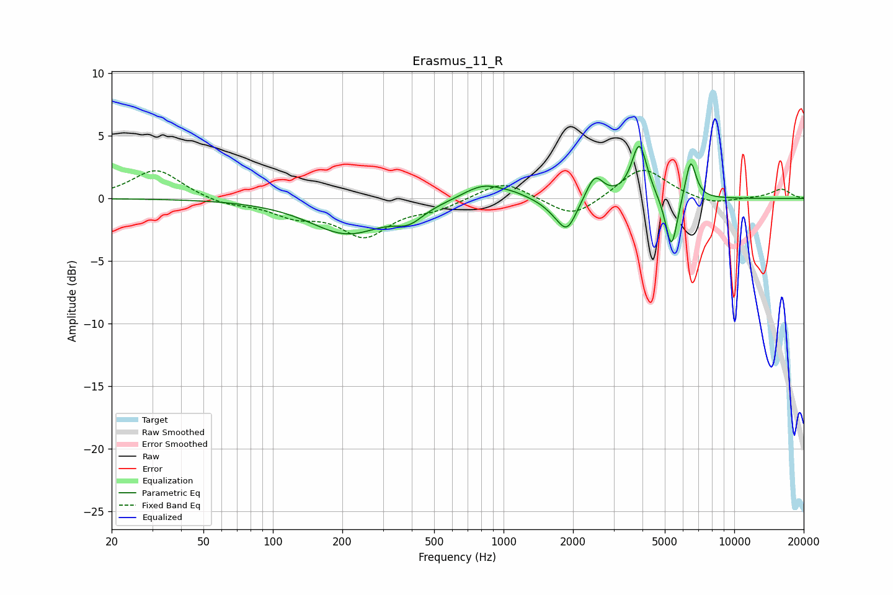

# Erasmus_11_R
See [usage instructions](https://github.com/jaakkopasanen/AutoEq#usage) for more options and info.

### Parametric EQs
Apply preamp of -4.3 dB when using parametric equalizer.

|   # | Type    |   Fc (Hz) |    Q |   Gain (dB) |
|-----|---------|-----------|------|-------------|
|   1 | Peaking |       209 | 0.87 |        -2.8 |
|   2 | Peaking |       389 | 2.27 |        -1.1 |
|   3 | Peaking |       818 | 1.57 |         1.3 |
|   4 | Peaking |      1101 | 2.45 |         0.2 |
|   5 | Peaking |      1645 | 2.79 |        -0.5 |
|   6 | Peaking |      1886 | 3.38 |        -2.4 |
|   7 | Peaking |      2485 | 3.88 |         1.9 |
|   8 | Peaking |      3878 | 4.24 |         4.4 |
|   9 | Peaking |      5342 | 5.34 |        -4.4 |
|  10 | Peaking |      6468 | 5.86 |         3.3 |

### Fixed Band EQs
When using fixed band (also called graphic) equalizer, apply preamp of **-2.3 dB** (if available) and set gains manually with these parameters.

|   # | Type    |   Fc (Hz) |    Q |   Gain (dB) |
|-----|---------|-----------|------|-------------|
|   1 | Peaking |        31 | 1.41 |         2.4 |
|   2 | Peaking |        62 | 1.41 |        -0.5 |
|   3 | Peaking |       125 | 1.41 |        -1.2 |
|   4 | Peaking |       250 | 1.41 |        -2.8 |
|   5 | Peaking |       500 | 1.41 |        -0.7 |
|   6 | Peaking |      1000 | 1.41 |         1.5 |
|   7 | Peaking |      2000 | 1.41 |        -1.7 |
|   8 | Peaking |      4000 | 1.41 |         2.6 |
|   9 | Peaking |      8000 | 1.41 |        -0.5 |
|  10 | Peaking |     16000 | 1.41 |         0.7 |

### Graphs

